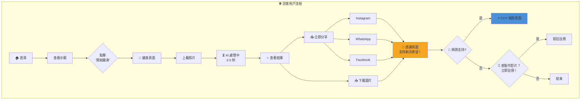
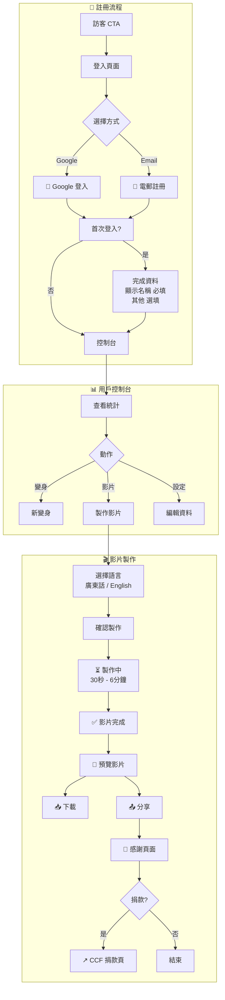
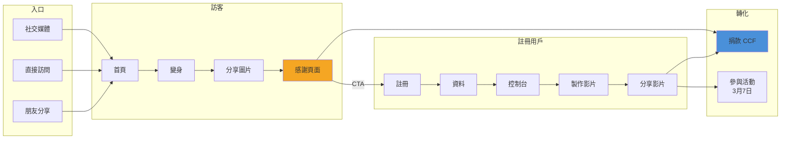

# 剃亮希望 Shave for Hope
## CCF 兒童癌病基金 AI 籌款活動專案計劃書

> 📋 **技術開發計劃:** [[2026-01-06-ccf-shave-for-hope-technical-plan]]

---

## 行政摘要 Executive Summary

**剃亮希望** 是一個創新的數碼籌款活動，運用 AI 技術讓支持者體驗「虛擬剃頭」，以此表達對癌症兒童的支持，並透過社交媒體分享來擴大籌款影響力。

### 核心價值主張

| 對象 | 價值 |
|------|------|
| **支持者** | 零風險體驗剃頭，輕鬆參與公益 |
| **CCF** | 擴大品牌觸及率，創新籌款渠道 |
| **癌童家庭** | 獲得更多社會關注與實際支援 |

### 專案快覽

| 項目 | 內容 |
|------|------|
| **活動名稱** | 剃亮希望 Shave for Hope |
| **受惠機構** | 兒童癌病基金 Children's Cancer Foundation Hong Kong |
| **核心功能** | AI 光頭變身 → 影片製作 → 社交分享 |
| **目標平台** | Web (Mobile-first) |
| **社交媒體** | Instagram, WhatsApp, Facebook |
| **活動標籤** | #shaveforhopehk |
| **語言** | 繁體中文 + English |
| **實體活動** | Head Shaving Day 2026 - 3月7日 中環街市 |

---

## Head Shaving Day 2026 實體活動

| 項目 | 內容 |
|------|------|
| **活動日期** | 2026年3月7日 (星期六) |
| **活動地點** | 中環街市 Central Market |
| **活動內容** | 嘉賓及公眾現場剃頭、CCF 展覽推廣 |
| **網站上線** | 2026年2月底前 |

### 活動目標

1. **提高社會關注** - 透過「剃亮希望」社交活動吸引公眾參與
2. **推廣實體活動** - 宣傳 Head Shaving Day 2026
3. **鼓勵捐款** - 引導用戶設定籌款目標並捐款支持 CCF

---

## Demo 展示

### 首頁 - AI 光頭變身前後對比


### 光頭變身頁面 - 照片上載介面


### 體驗連結

| 資源 | 連結 |
|------|------|
| **線上 Demo** | <https://9000-firebase-studio-1767151534598.cluster-4khg5orimngp2stqyrumfwvpdi.cloudworkstations.dev> |
| **Demo 影片** | <https://www.loom.com/share/fbc425b4df6e466884863fc035a6b501> |

---

## 用戶旅程 User Journey

### Flow A: 訪客用戶 (無需登入)



### Flow B: 註冊用戶 (Virtual Shaver)



### 完整用戶旅程



---

## 新增功能 New Features (5 Jan 2026 Update)

### 🎬 影片製作功能 (Video Generation)

- **技術**: Google Gemini Veo 3.1
- **內容**: 用戶照片從「有頭髮」優雅變身至「光頭」
- **語音**: 用戶可選擇廣東話或英語
  - 廣東話: 「剃亮希望。我支持！」
  - English: "Shave for Hope. I support!"
- **時長**: 約 8 秒
- **對象**: 僅限註冊用戶

### 👤 用戶分級

| 用戶類型 | 功能 |
|----------|------|
| **訪客** | AI 變身 ✅ 下載圖片 ✅ 社交分享 ✅ |
| **註冊用戶** | 以上全部 + 影片製作 ✅ 個人資料 ✅ |

### 📝 註冊資料

| 欄位 | 必填 |
|------|------|
| 顯示名稱 | ✅ 必填 |
| 電郵地址 | ✅ 自動 (OAuth/註冊) |
| Instagram 帳號 | ❌ 選填 |
| 籌款目標 | ❌ 選填 |
| 個人故事 | ❌ 選填 |
| 語言偏好 | ❌ 選填 (預設繁中) |

---

## 成功指標 KPIs

### 第一階段目標 (首 3 個月)

| 指標 | 目標 | 衡量方式 |
|------|------|----------|
| **參與人數** | 5,000+ | 完成 AI 變身的用戶數 |
| **社交分享** | 2,000+ | Instagram 分享次數 |
| **籌款金額** | HK$500,000+ | 透過個人籌款頁募得 |
| **品牌曝光** | 100,000+ | 社交媒體觸及人數 |

### 長期價值

- 建立可重複使用的數碼籌款平台
- 累積支持者數據庫
- 創造病毒式傳播潛力

---

## 專案時間表 Timeline

| 階段 | 內容 | 狀態 | 目標日期 |
|------|------|------|----------|
| **Phase 1: MVP 開發** | UI 介面開發、AI 變身功能 | ✅ 完成 | - |
| **Phase 2: 功能完善** | 登入系統、影片製作、社交分享 | 🔄 進行中 | 2月中 |
| **Phase 3: 品牌整合** | CCF 品牌元素、GCP 專案設定 | ⏳ 待開始 | 2月中 |
| **Phase 4: 測試** | 內部測試、錯誤修復 | ⏳ 待開始 | 2月底 |
| **Phase 5: 正式上線** | 公開發布、配合活動宣傳 | ⏳ 待開始 | 2月底 |
| **Head Shaving Day** | 實體活動 - 中環街市 | 📅 | 3月7日 |

---

## 風險評估與緩解 Risk Assessment

| 風險 | 影響 | 緩解措施 |
|------|------|----------|
| **AI 生成效果不佳** | 用戶體驗差 | 已測試多個模型，選用最佳效果 |
| **伺服器負載** | 系統不穩定 | 使用 Firebase 自動擴展 |
| **品牌形象風險** | 不當使用 | 設定使用條款、每日次數限制 |
| **數據私隱** | 法律風險 | 符合 PDPO、明確私隱政策 |
| **影片製作時間長** | 用戶流失 | 等待畫面顯示活動資訊 |

---

## 品牌與設計規範

| 元素 | 規格 |
|------|------|
| **主色調** | 暖橙色 #F5A623 (希望、溫暖) |
| **輔助色** | 黃色 #F8E71C、藍色 #4A90D9 |
| **設計風格** | 溫暖、正面、鼓勵參與 |
| **語言** | 繁體中文 + English (雙語) |
| **活動標籤** | #shaveforhopehk |
| **響應式設計** | Mobile-first (70% 流量預計來自手機) |

### 社交分享模板

```
我為希望剃頭！🎗️ 支持兒童癌病基金

立即參與：[APP_LINK]

#shaveforhopehk #剃亮希望 #兒童癌病基金
```

---

## 下一步行動 Next Steps

### 需要 CCF 配合事項

- [ ] 確認品牌使用授權 (Logo、顏色、名稱)
- [ ] 提供官方捐款頁面連結整合方式
- [ ] 指定項目聯絡人
- [ ] 審批活動條款與私隱政策
- [ ] 提供新 GCP 專案憑證
- [ ] 確認 Head Shaving Day 活動詳情

### 開發團隊待辦事項

- [ ] 設定正式網域 (建議: shaveforhope.ccf.org.hk)
- [ ] 整合 CCF 官方捐款系統
- [ ] 設計 Instagram 分享圖片模板（加入 CCF 標誌）
- [ ] 上線前安全審查
- [ ] 設定 Google Analytics 追蹤
- [ ] 實現用戶登入系統 (Google OAuth + Email)
- [ ] 開發影片製作功能 (Veo 3.1)
- [ ] 實現社交分享功能 (IG, WhatsApp, FB)
- [ ] 新增雙語支援
- [ ] 新增等待畫面（顯示活動資訊）

---

# 技術附錄 Technical Appendix

> *以下內容供開發團隊參考*

## 技術架構

### 前端
- **框架**: Next.js 15 + Tailwind CSS
- **語言**: TypeScript
- **UI 組件**: Shadcn/ui

### 後端 (Firebase)
- **驗證**: Firebase Authentication (Google、電郵)
- **資料庫**: Cloud Firestore
- **儲存**: Firebase Storage (相片、影片)
- **託管**: Firebase App Hosting

### AI 模型
- **圖片變身**: `gemini-2.5-flash-image-preview`
- **影片製作**: `veo-3.1` (Google Gemini)
- **功能**: 人像照片 → 光頭變身 → 影片製作

---

## 資料結構

### 用戶資料 (Firestore: `users`)

```javascript
{
  displayName: "用戶名稱",
  email: "user@example.com",
  avatar: "url",
  instagramHandle: "@username",
  language: "zh", // or "en"
  createdAt: timestamp,
  fundraisingTarget: 5000,  // HKD (選填)
  personalStory: "支持原因..." // (選填)
}
```

### 變身記錄 (Firestore: `transformations`)

```javascript
{
  userId: "user_id",
  originalImageUrl: "firebase_storage_url",
  transformedImageUrl: "firebase_storage_url",
  videoUrl: "firebase_storage_url", // 選填
  videoStatus: "completed", // pending, processing, completed, failed
  videoLanguage: "cantonese", // or "english"
  createdAt: timestamp,
  shareCount: 15
}
```

---

## 頁面結構

| 頁面 | 路徑 | 功能 |
|------|------|------|
| **首頁** | `/` | 活動介紹、示範、統計、CTA |
| **登入/註冊** | `/auth` | Google OAuth、電郵 |
| **光頭變身** | `/transform` | 上載照片、AI 處理、前後對比 |
| **我的主頁** | `/dashboard` | 籌款進度、最近變身、製作影片 |
| **我的籌款頁** | `/u/[slug]` | 公開頁面、捐款連結、支持者留言 |
| **排行榜** | `/leaderboard` | 籌款英雄榜 |
| **設定** | `/settings` | 編輯個人資料 |

---

## 系統限制

| 項目 | 限制 | 原因 |
|------|------|------|
| 每日變身次數 | 5 次/用戶 | 控制 API 成本 |
| 每日影片次數 | 3 次/用戶 | 影片 API 成本較高 |
| 圖片大小 | 最大 10MB | 處理效能 |
| 支援格式 | JPG, PNG, WEBP | AI 模型支援 |

---

## 開發資源連結

| 資源 | 連結 |
|------|------|
| Firebase Studio 專案 | <https://studio.firebase.google.com/studio-3022188308> |
| GitHub Repository | <https://github.com/ZorroCheng-MC/shaveforhope> |
| Prompt 生成對話 | <https://claude.ai/share/16d6bbbf-ed5c-450b-9691-4b3214634fa7> |
| CCF 官網 | <https://ccf.org.hk> |
| 技術計劃書 | [[2026-01-06-ccf-shave-for-hope-technical-plan]] |

---

*文件版本: 2.0 | 建立日期: 2025-12-31 | 最後更新: 2026-01-06*

#project #ccf #firebase-studio #fundraising #charity #ai-image-generation
