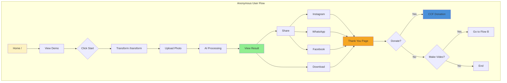
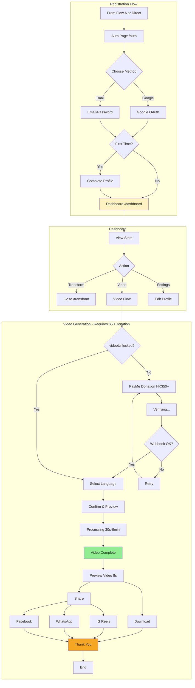
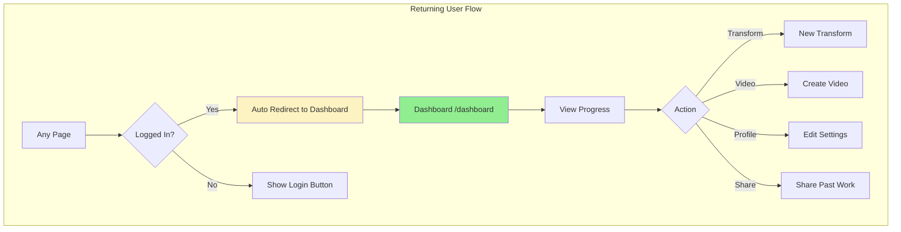
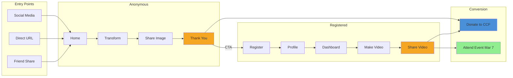
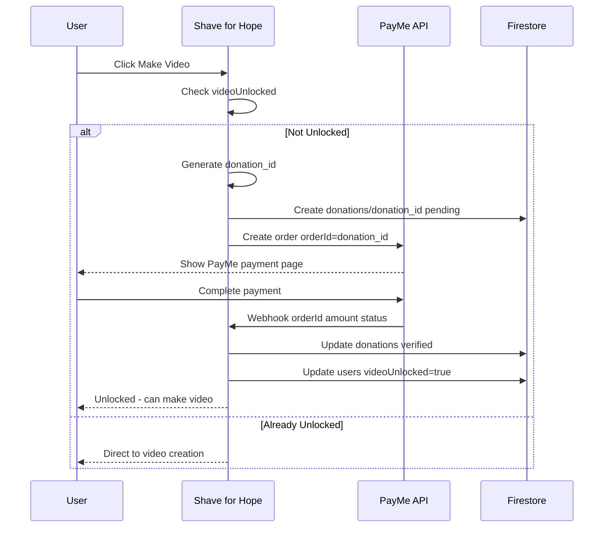
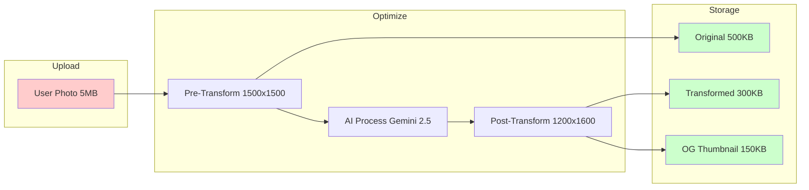
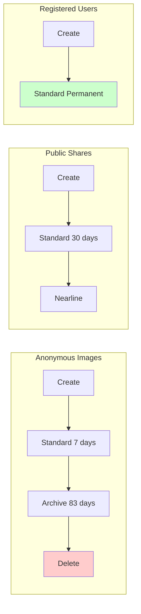

# 剃亮希望 技術開發計劃
# Shave for Hope - Technical Implementation Plan

> 📋 高層次專案計劃請參閱 [[2025-12-31-ccf-shave-for-hope-firebase-studio-project]]

---

## 專案摘要 Project Summary

| 項目 | 內容 |
|------|------|
| **專案名稱** | 剃亮希望 Shave for Hope |
| **機構** | 兒童癌病基金 CCF Hong Kong |
| **活動日期** | 2026年3月7日 Head Shaving Day |
| **上線目標** | 2026年2月底 |
| **活動標籤** | #shaveforhopehk |
| **語言** | 繁體中文 + English |

---

## 目前狀態 Current State

> 📅 更新日期: 2026-01-09

| 組件 | 狀態 | 備註 |
|------|------|------|
| 8 個 UI 頁面 | ✅ 完成 | 真實數據整合 |
| AI 圖片變身 | ✅ 運作中 | Gemini 2.5 Flash |
| 社交分享 (IG/WA/FB) | ✅ 運作中 | OG 預覽已優化 |
| shadcn/ui 組件 | ✅ 就緒 | 45+ 組件 |
| Firebase 後端 | ✅ 已整合 | Auth, Firestore, Storage |
| 用戶認證 | ✅ 運作中 | Google OAuth + Email |
| 圖片優化 | ✅ 運作中 | 85% 檔案大小節省 |
| Storage DLC | ✅ 已設定 | 7天歸檔, 90天刪除 |
| 統計追蹤 | ✅ 運作中 | 用戶/圖片/分享 |
| 手機相機支援 | ✅ 運作中 | 前後鏡頭切換 |
| PayMe 捐款整合 | ❌ 未開始 | 影片解鎖門檻 ≥$50 |
| 影片製作 | ❌ 未開始 | Veo 3.1 (需 PayMe 先完成) |
| 雙語支援 | ❌ 僅中文 | 待開發 |

---

## 用戶流程圖 User Flows

### Flow A: 訪客用戶 (無需登入)



**分享模板:**
```
我為希望剃頭！🎗️ 支持兒童癌病基金
立即參與：shaveforhope.ccf.org.hk
#shaveforhopehk #剃亮希望
```

---

### Flow B: 註冊用戶 (Virtual Shaver)



---

### Flow C: 回訪用戶



---

### 完整用戶旅程概覽



---

## 頁面地圖 Page Map

| 路徑 | 頁面 | 認證 | 描述 |
|------|------|------|------|
| `/` | 首頁 | 否 | 著陸頁、示範、統計、CTA |
| `/transform` | 變身 | 否 | 上載照片 & AI 變身 |
| `/auth` | 登入/註冊 | 否 | Google OAuth + 電郵/密碼 |
| `/dashboard` | 控制台 | 是 | 用戶統計、歷史、製作影片 |
| `/settings` | 設定 | 是 | 編輯個人資料 |
| `/leaderboard` | 排行榜 | 否 | 籌款排名 |
| `/u/[userId]` | 公開個人頁 | 否 | 可分享的籌款頁面 |

---

## 個人資料欄位 Profile Fields

| 欄位 | 必填 | 時機 |
|------|------|------|
| 顯示名稱 | ✅ **必填** | 首次註冊 |
| 電郵 | ✅ 自動 | OAuth/註冊時 |
| Instagram 帳號 | ❌ 選填 | 設定頁面 |
| 籌款目標 | ❌ 選填 | 設定頁面 |
| 個人故事 | ❌ 選填 | 設定頁面 |
| 語言偏好 | ❌ 選填 | 設定 (預設: 繁中) |

---

## 社交分享矩陣 Social Sharing Matrix

| 平台 | 圖片 | 影片 | 方式 |
|------|------|------|------|
| **Instagram** | ✅ | ✅ | 下載 + 複製文案 |
| **WhatsApp** | ✅ | ✅ | `wa.me/?text=` 深層連結 |
| **Facebook** | ✅ | ✅ | FB 分享對話框 |
| **複製連結** | ✅ | ✅ | Clipboard API |

---

## 開發階段 Implementation Phases

### Phase 1: Firebase 基礎建設 (優先級: 高)

**新增檔案:**
```
src/lib/firebase/
├── config.ts          # Firebase 應用程式初始化
├── auth.ts            # 認證輔助函數
├── firestore.ts       # CRUD 操作
├── storage.ts         # 檔案上載函數
└── types.ts           # TypeScript 類型

src/context/
└── AuthContext.tsx    # 認證狀態 Provider

src/hooks/
└── useAuth.ts         # 認證 Hook
```

**需修改檔案:**
- `src/app/auth/page.tsx` - 連接 Firebase Auth
- `src/app/layout.tsx` - 加入 AuthProvider
- `src/components/layout/header.tsx` - 真實認證狀態

**Firestore Schema:**
```
users/{uid}
├── displayName: string (必填)
├── email: string
├── avatarUrl: string?
├── instagramHandle: string?
├── fundraisingGoal: number?
├── personalStory: string?
├── language: 'zh' | 'en'
├── createdAt: timestamp
└── updatedAt: timestamp

transformations/{id}
├── userId: string
├── originalImageUrl: string
├── transformedImageUrl: string
├── videoUrl: string?
├── videoStatus: 'pending' | 'processing' | 'complete' | 'failed'
├── videoLanguage: 'zh' | 'en'
├── shareCount: number
├── isPublic: boolean
└── createdAt: timestamp
```

---

### Phase 2: 核心功能 (優先級: 高)

**社交分享 (`src/lib/share.ts`):**
- Instagram: 下載圖片 + 複製文案
- WhatsApp: `wa.me/?text=` 深層連結
- Facebook: FB 分享對話框
- 複製連結: Clipboard API

**分享模板:**
```
我為希望剃頭！支持兒童癌病基金 🎗️
立即參與：{url}
#shaveforhopehk #剃亮希望
```

**需修改檔案:**
- `src/components/transform-form.tsx` - Storage 整合、分享按鈕
- `src/app/dashboard/page.tsx` - 真實 Firestore 數據
- `src/app/u/[userId]/page.tsx` - 從 Firestore 讀取公開頁面
- `src/app/leaderboard/page.tsx` - 真實排名
- `src/app/settings/page.tsx` - 儲存至 Firestore

**新增組件:**
```
src/components/
├── share-buttons.tsx       # IG, WhatsApp, FB, 複製
├── event-info-card.tsx     # Head Shaving Day 資訊
└── countdown-timer.tsx     # 距離 3月7日 倒數
```

---

### Phase 2.5: PayMe 捐款整合 (優先級: 高) ⭐ NEW

> **目的:** 影片製作功能需用戶捐款 ≥HK$50 才能解鎖

**整合方式:** PayMe for Business API + Webhook

**核心原則:** Donation ID 連結模式
```
用戶登入 → 生成 donation_id → 建立 PayMe 訂單 (orderId = donation_id)
→ 用戶付款 → Webhook 回傳 orderId → 匹配 donation_id → 解鎖影片
```

**新增檔案:**
```
src/lib/payme/
├── config.ts              # PayMe API 設定
├── createPayment.ts       # 建立付款請求
├── verifyWebhook.ts       # 驗證 Webhook 簽名
└── types.ts               # PayMe 類型定義

src/app/api/
├── payme/
│   ├── create/route.ts    # POST: 建立 PayMe 訂單
│   └── webhook/route.ts   # POST: 接收 PayMe 回調
└── donations/
    └── status/route.ts    # GET: 查詢捐款狀態

src/components/
├── donation-gate.tsx      # 捐款門檻組件
├── payme-button.tsx       # PayMe 付款按鈕
└── donation-status.tsx    # 捐款狀態顯示
```

**Firestore Schema 更新:**
```
users/{uid}
├── ... (existing fields)
├── donationStatus: 'none' | 'pending' | 'verified'
├── totalDonated: number        # HKD 累計
├── videoUnlocked: boolean      # ≥$50 時自動設為 true
└── lastDonationAt: timestamp

donations/{donationId}
├── donationId: string          # 系統生成 (e.g., "D00059848")
├── userId: string
├── amount: number              # HKD
├── paymentMethod: 'payme'
├── paymeOrderId: string        # PayMe Transaction ID
├── status: 'pending' | 'verified' | 'failed'
├── walletIndicator: string     # PayMe 用戶 hash
├── createdAt: timestamp
└── verifiedAt: timestamp
```

**PayMe Webhook 處理流程:**


**環境變數 (新增):**
```env
# PayMe for Business
PAYME_MERCHANT_ID=
PAYME_API_KEY=
PAYME_WEBHOOK_SECRET=
PAYME_API_URL=https://api.payme.hsbc.com.hk/
```

**安全考慮:**
- Webhook 需驗證 HMAC 簽名
- 使用 HTTPS only
- donation_id 使用 UUID v4
- 金額驗證需在伺服器端 (≥$50)

---

### Phase 3: 影片製作功能 (優先級: 中)

> ⚠️ **前置條件:** 需完成 Phase 2.5 PayMe 整合，用戶需 videoUnlocked = true

**技術:** Gemini Veo 3.1 圖片轉影片

**方法:** 使用描述性提示詞的圖片轉影片:
- 輸入: 有頭髮的照片 + 光頭照片
- 提示詞描述: 優雅的變身 + 說出台詞
- 讓 Veo 處理動畫和語音生成

**新增檔案:**
```
src/ai/flows/
└── generate-transformation-video.ts

src/components/
├── video-generator.tsx
└── video-waiting-screen.tsx
```

**影片規格:**
- 開始: 原始照片 (有頭髮)
- 結束: 光頭照片
- 動態: 優雅的頭髮到光頭變身
- 語音: 說出「剃亮希望。我支持！」或 "Shave for Hope. I support!"
- 時長: 約 8 秒
- 用戶選擇: 廣東話或英語

**示範提示詞:**
```
Create a video showing a person gracefully transforming from having
hair to a shaved head. The person should speak [SCRIPT] at the end
of the video while smiling confidently. The transformation should
feel hopeful and empowering.
```

**等待時間內容 (30秒-6分鐘):**
- 顯示 Head Shaving Day 活動資訊
- 中環街市位置
- CCF 使命故事
- 進度指示

**風險緩解:**
| 風險 | 緩解措施 |
|------|---------|
| 處理時間長 | 隊列系統、等待時顯示活動資訊 |
| 成本高 | 限制次數 (每用戶3條)、僅限註冊用戶 |
| 質量不一 | 允許重試、分享前預覽 |

---

### Phase 4: 雙語支援 (優先級: 中)

**新增檔案:**
```
src/lib/i18n/
├── index.ts
├── zh.ts              # 繁體中文
└── en.ts              # English

src/context/
└── LanguageContext.tsx

src/components/
└── language-toggle.tsx
```

**需修改檔案:**
- `src/lib/constants.ts` - 重構為 i18n
- `src/components/layout/header.tsx` - 加入語言切換

---

### Phase 5: 上線準備 (優先級: 高)

- [ ] 從 ccf.org.hk 擷取 CCF 品牌素材
- [ ] SEO meta 標籤和 OG 圖片
- [ ] 手機優化測試
- [ ] 錯誤監控設置
- [ ] 效能優化
- [ ] 部署至新 GCP 專案

---

## 環境變數 Environment Variables

```env
# Firebase (從新 GCP 專案)
NEXT_PUBLIC_FIREBASE_API_KEY=
NEXT_PUBLIC_FIREBASE_AUTH_DOMAIN=
NEXT_PUBLIC_FIREBASE_PROJECT_ID=
NEXT_PUBLIC_FIREBASE_STORAGE_BUCKET=
NEXT_PUBLIC_FIREBASE_MESSAGING_SENDER_ID=
NEXT_PUBLIC_FIREBASE_APP_ID=

# Google AI
GOOGLE_API_KEY=

# ================================================================
# PAYMENT GATEWAY CREDENTIALS (FROM CCF - CONFIDENTIAL)
# ================================================================

# PayMe for Business (HSBC)
# Gateway: https://payme.hsbc.com.hk/zh-hk/business-api
PAYME_CLIENT_ID=60e574f7-69f5-433f-957d-2b366fc38798
PAYME_CLIENT_SECRET=[REDACTED]
PAYME_SIGNING_KEY_ID=371adea3-9ab3-441f-bfa9-62247dd7edb6
PAYME_SIGNING_KEY=[REDACTED]
PAYME_API_URL=https://api.payme.hsbc.com.hk/

# Alipay (AlipayPlus)
# Gateway: https://docs.alipayplus.com/alipayplus/
ALIPAY_PARTNER_ID=2088131201781639
ALIPAY_MD5_KEY=[REDACTED]

# ================================================================

# App
NEXT_PUBLIC_APP_URL=
NEXT_PUBLIC_MIN_DONATION_AMOUNT=50
```

---

## 支付網關整合 Payment Gateway Integration

> ⚠️ **機密資料** - 以下為 CCF 提供的正式 API 憑證

### PayMe for Business (HSBC)

| 項目 | 值 |
|------|-----|
| **Gateway** | https://payme.hsbc.com.hk/zh-hk/business-api |
| **Client ID** | `60e574f7-69f5-433f-957d-2b366fc38798` |
| **Client Secret** | `[REDACTED]` |
| **Signing Key ID** | `371adea3-9ab3-441f-bfa9-62247dd7edb6` |
| **Signing Key** | `[REDACTED]` |

**API 文檔:** https://payme.hsbc.com.hk/zh-hk/business-api

### Alipay (AlipayPlus)

| 項目 | 值 |
|------|-----|
| **Gateway** | https://docs.alipayplus.com/alipayplus/ |
| **Partner ID** | `2088131201781639` |
| **MD5 Key** | `[REDACTED]` |

**API 文檔:** https://docs.alipayplus.com/alipayplus/

### 整合優先級

| 優先級 | 支付方式 | 狀態 | 用途 |
|--------|----------|------|------|
| 🥇 P0 | PayMe | ⏳ 待開發 | 主要 - 影片解鎖門檻 |
| 🥈 P1 | Alipay | ⏳ 待開發 | 次要 - 內地訪客覆蓋 |
| 🥉 P2 | 信用卡 | ⏳ 待定 | 加分項 |

---

## 檔案摘要 File Summary

**新增檔案 (26):**
- 5 個 Firebase lib 檔案
- 2 個 Context providers
- 2 個自訂 hooks
- 3 個 i18n 檔案
- 3 個 Server actions
- 1 個 AI flow (影片)
- 7 個組件
- 1 個分享工具
- 1 個 .env 模板

**需修改檔案 (12):**
- `src/app/auth/page.tsx`
- `src/app/dashboard/page.tsx`
- `src/app/u/[userId]/page.tsx`
- `src/app/leaderboard/page.tsx`
- `src/app/settings/page.tsx`
- `src/app/layout.tsx`
- `src/app/transform/page.tsx`
- `src/components/transform-form.tsx`
- `src/components/layout/header.tsx`
- `src/lib/constants.ts`
- `src/lib/types.ts`
- `next.config.ts`

---

## MVP vs 加分項 MVP vs Nice-to-Have

**MVP (必須上線):**
1. ✅ Firebase Auth (Google + Email)
2. ✅ 圖片變身 + Firebase Storage
3. ✅ 社交分享 (WhatsApp + 複製連結 最低要求)
4. ✅ 基本控制台配合真實數據
5. ✅ 活動資訊組件
6. ⏳ **PayMe 捐款整合** (影片解鎖門檻)
7. ⏳ **影片製作** (需先完成 PayMe)

**加分項 (上線後可補):**
1. 完整雙語切換
2. 排行榜篩選功能
3. 公開籌款頁面
4. 其他支付方式 (信用卡、FPS)

---

## 外部依賴 Dependencies on External Teams

1. **CCF**: 品牌素材審批、捐款頁面 URL
2. **GCP**: 新專案憑證
3. **捐款頁面團隊**: 籌款目標頁面 (範圍外)

---

## 儲存架構 Storage Architecture

> 📅 更新日期: 2026-01-09

### Firebase Storage 路徑結構

```
Firebase Storage
├── /transformations/{userId}/
│   ├── original_{timestamp}.jpg      # 用戶原圖 (~500KB)
│   └── transformed_{timestamp}.jpg   # 變身後圖片 (~300KB)
│
├── /anonymous/{visitorId}/
│   ├── original_{timestamp}.jpg      # 訪客原圖 (~500KB)
│   └── transformed_{timestamp}.jpg   # 訪客變身圖 (~300KB)
│
├── /public/shares/
│   ├── {timestamp}_{randomId}.jpg    # 分享圖片 (~300KB)
│   └── og_{timestamp}_{randomId}.jpg # OG 縮圖 (~150KB, 1200x630)
│
├── /videos/{userId}/
│   └── video_{timestamp}.mp4         # 用戶影片 (~10-30MB)
│
├── /avatars/{userId}/
│   └── avatar.jpg                    # 頭像 (~200KB)
│
└── /archive/                         # DLC 歸檔 (唯讀)
    └── anonymous/{visitorId}/...     # 7天後自動移入
```

---

### 圖片優化流程 Image Optimization Pipeline



**優化設定:**

| 類型 | 最大尺寸 | 品質 | 格式 | 預估大小 |
|------|----------|------|------|----------|
| Pre-Transform | 1500x1500 | 85% | JPEG | ~500KB |
| Post-Transform | 1200x1600 | 80% | JPEG | ~300KB |
| OG Thumbnail | 1200x630 | 75% | JPEG | ~150KB |

**成本效益:** 從 ~1.9MB 降至 ~300KB = **85% 節省**

---

### 數據生命週期 Data Lifecycle Configuration (DLC)



**生命週期規則:**

| 路徑 | Standard | Nearline | Archive | 刪除 |
|------|----------|----------|---------|------|
| `/anonymous/` | 0-7天 | - | 7-90天 | 90天後 |
| `/public/shares/` | 0-30天 | 30天+ | - | 不刪除 |
| `/transformations/` | 永久 | - | - | 不刪除 |
| `/videos/` | 永久 | - | - | 不刪除 |

---

### Firestore Collections

```
Firestore
├── /users/{uid}                      # 用戶資料
│   ├── displayName, email, etc.
│   └── createdAt, updatedAt
│
├── /transformations/{id}             # 註冊用戶的變身記錄
│   ├── userId, originalImageUrl, transformedImageUrl
│   ├── videoUrl?, videoStatus
│   └── shareCount, isPublic, createdAt
│
├── /anonymousTransformations/{id}    # 訪客變身記錄 (7天保留)
│   ├── visitorId, originalImageUrl, transformedImageUrl
│   └── createdAt
│
├── /shares/{shareId}                 # 公開分享頁面
│   ├── imageUrl, ogImageUrl          # 主圖 + OG縮圖
│   ├── userId?, platform
│   └── createdAt
│
├── /anonymousQuotas/{visitorId}      # 訪客配額 (每日限制)
│   ├── dailyImageCount, lastImageDate
│   └── dailyVideoCount, lastVideoDate
│
└── /statistics/{global}              # 全域統計
    ├── totalUsers, totalImagesAnonymous, totalImagesLoggedIn
    ├── totalVideos, totalShares
    └── sharesByPlatform: {whatsapp, facebook, instagram, copy}
```

---

### 儲存成本預估 Storage Cost Estimate

**假設:** 每月 1000 次變身 (70% 訪客, 30% 註冊用戶)

| 項目 | 數量 | 單位大小 | 總大小 | 保留期 |
|------|------|----------|--------|--------|
| 訪客原圖 | 700 | 500KB | 350MB | 90天 |
| 訪客變身圖 | 700 | 300KB | 210MB | 90天 |
| 註冊原圖 | 300 | 500KB | 150MB | 永久 |
| 註冊變身圖 | 300 | 300KB | 90MB | 永久 |
| 分享圖 | 500 | 300KB | 150MB | 永久 |
| OG 縮圖 | 500 | 150KB | 75MB | 永久 |

**每月新增:** ~1GB (其中 ~560MB 為訪客，90天後刪除)

**Firebase Storage 定價 (asia-east1):**
- Standard: $0.026/GB/月
- Nearline: $0.01/GB/月
- Archive: $0.0025/GB/月

**預估月費:** < $1 USD (歸檔後)

---

### 社交分享 OG 標籤 Social Share OG Tags

**分享頁面 URL:** `https://shaveforhope.ccf.org.hk/share/{shareId}`

```html
<!-- OG Tags (自動從 Firestore 讀取) -->
<meta property="og:image" content="{ogImageUrl}" />
<meta property="og:image:width" content="1200" />
<meta property="og:image:height" content="630" />
<meta property="og:title" content="我為希望剃頭！" />
<meta property="og:description" content="支持兒童癌病基金 #shaveforhopehk" />
```

**WhatsApp 分享格式 (單一 URL 確保預覽):**
```
我為希望剃頭！🎗️ 支持兒童癌病基金 #shaveforhopehk #剃亮希望

https://shaveforhope.ccf.org.hk/share/{shareId}
```

---

## 技術棧 Tech Stack

| 類別 | 技術 |
|------|------|
| **框架** | Next.js 15 + React 19 |
| **語言** | TypeScript |
| **樣式** | Tailwind CSS |
| **UI 組件** | shadcn/ui |
| **AI 圖片** | Gemini 2.5 Flash (gemini-2.5-flash-image-preview) |
| **AI 影片** | Gemini Veo 3.1 (待整合) |
| **AI 框架** | Google Genkit |
| **後端** | Firebase (Auth, Firestore, Storage) |
| **表單** | React Hook Form + Zod |
| **圖標** | Lucide Icons |

---

## GitHub Repository

**URL:** https://github.com/ZorroCheng-MC/shaveforhope

**分支:** main

**開發指令:**
```bash
# 安裝依賴
npm install

# 啟動開發伺服器 (port 9002)
npm run dev

# TypeScript 類型檢查
npm run typecheck

# 生產環境建置
npm run build
```

---

*文件版本: 1.2 | 建立日期: 2026-01-06 | 最後更新: 2026-01-21 (新增 Phase 2.5 PayMe 捐款整合)*
