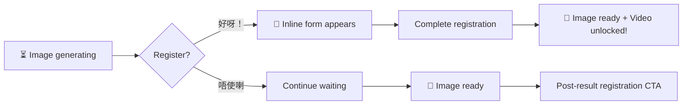
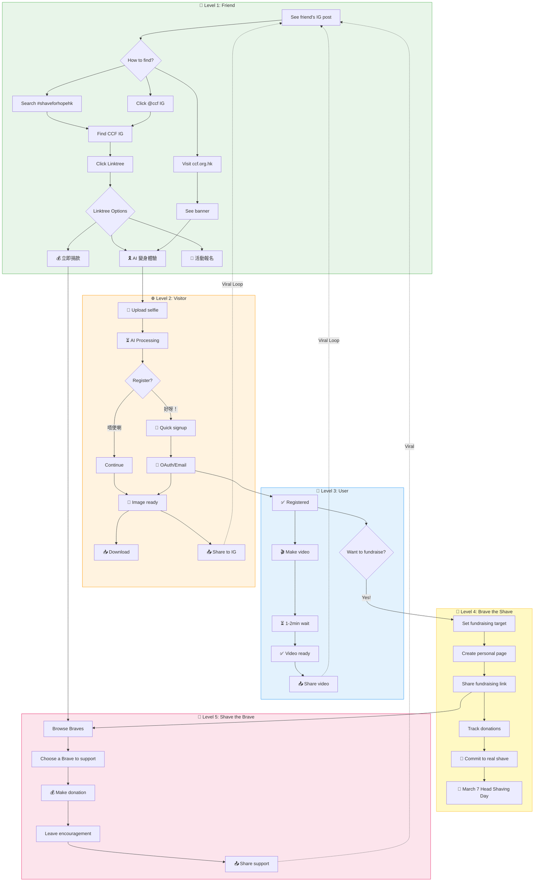

# 剃亮希望 User Journey Strategy

Complete user flow from Instagram discovery to viral sharing for Shave for Hope CCF campaign.

## Core Idea

Create a **searchable bridge** between user Instagram posts and the Shave for Hope campaign. Since Instagram doesn't allow clickable links in post captions, the strategy relies on:
1. Consistent hashtags and @mentions to make the campaign findable
2. CCF's official IG (@childrenscancerfoundationhk) as the hub with "link in bio"
3. Strategic upselling during AI processing wait times
4. Optimized sharing flow to complete the viral loop

## Why It Matters

- **Discovery Problem**: IG doesn't support links in posts - users need alternative ways to find the campaign
- **Conversion Opportunity**: Wait times during AI processing (5-10s for photo, 1-2min for video) are prime upsell moments
- **Viral Loop**: Each participant can bring new participants through IG shares
- **Campaign Success**: March 7, 2026 Head Shaving Day depends on viral growth

---

## Phase 1: Discovery (IG Post → Finding Campaign)

### The Problem
Instagram doesn't allow clickable links in post captions. When a user sees their friend's transformation post, how do they find the campaign?

### Caption Strategy for User Posts
```
我為希望剃頭！🎗️
支持兒童癌病基金 @childrenscancerfoundationhk

想試？搜尋「剃亮希望」或 IG 搵 @childrenscancerfoundationhk
#shaveforhopehk #剃亮希望 #CCF
```

### Key Elements
- **Tag official CCF IG**: `@childrenscancerfoundationhk`
- **Searchable hashtags**: `#shaveforhopehk` `#剃亮希望`
- **Call-to-action**: "搜尋「剃亮希望」" (Search "Shave for Hope")
- **Bilingual option** for English speakers

### CCF Official IG Strategy
- **Bio link → Linktree** (see Linktree Configuration below)
- Use "Link in bio" CTA in all campaign posts
- Create highlight story "剃亮希望" with swipe-up link
- Cross-reference user posts with reshares
- **Apply for Blue Tick verification** (see Client Action Items)
- **Daily countdown stories** to Head Shaving Day (see Client Action Items)

### Linktree Configuration

**Why Linktree?** Single bio link supports multiple destinations - campaign, donation, event info, main CCF site.

**Recommended Linktree Setup:**

| Priority | Link Title | Destination | Icon |
|----------|-----------|-------------|------|
| 1 | 🎗️ 剃亮希望 - AI 變身體驗 | shaveforhope.ccf.org.hk | ✨ |
| 2 | 💰 立即捐款支持 CCF | ccf.org.hk/donate | 💝 |
| 3 | 📅 Head Shaving Day 2026 | Event registration page | 📍 |
| 4 | 🏠 CCF 兒童癌病基金 | ccf.org.hk | 🏥 |

**Linktree Styling:**
- Use CCF brand colors (warm orange #F5A623)
- Add campaign header image
- Enable analytics tracking

### CCF.org.hk Homepage Integration

**Problem:** The Shave for Hope project site is NOT hosted on ccf.org.hk - users who land on the main CCF site need to be directed to our project.

**Recommended Solutions:**

| Option | Implementation | Visibility |
|--------|---------------|------------|
| **Banner (Top)** | Full-width banner at top of ccf.org.hk | High - all visitors see it |
| **Modal/Popup** | Show once per session on homepage | Very High - but interruptive |
| **Hero Section** | Dedicated section in homepage hero | High - natural placement |
| **Navigation Link** | Add "剃亮希望" to main nav | Medium - requires user action |

**Recommended: Banner + Nav Link**

```
┌─────────────────────────────────────────────────────────┐
│ 🎗️ 剃亮希望 2026 - 立即參與 AI 虛擬剃頭！ [了解更多 →] │
└─────────────────────────────────────────────────────────┘
```

**Banner Content:**
- Clear campaign name: "剃亮希望 2026"
- Value prop: "AI 虛擬剃頭體驗"
- CTA button: Links to shaveforhope.ccf.org.hk (or actual domain)
- Dismissible but persistent across pages during campaign period

**Coordination Required:**
- [ ] CCF web team to add banner to ccf.org.hk
- [ ] Agree on banner design matching CCF brand guidelines
- [ ] Set campaign period (Feb - March 7, 2026)
- [ ] Track click-through from banner to project site

---

## Phase 2: Conversion (Landing → Virtual Shaver Registration)

### Homepage Optimization
- Hero should immediately convey value prop
- Show community gallery (social proof from real IG posts)
- Clear CTA: "立即參與" button

### During Photo Transformation (5-10s) - Interactive Upsell

**Key Insight:** Don't just show passive loading - engage user with a decision point!

**Opening Message (Cantonese style):**
```
┌─────────────────────────────────────────────────────────┐
│  ✨ 幫緊你，幫緊你！                                    │
│                                                         │
│  圖片製作中...                                          │
│  ████████░░░░░░░░░░░░ 40%                              │
│                                                         │
│  你會唔會考慮成為登記用户，                             │
│  享受製作剃頭短片的機會？                               │
│                                                         │
│  ┌─────────────────┐  ┌─────────────────┐              │
│  │  ✅ 好呀！註冊   │  │  ❌ 唔使喇      │              │
│  └─────────────────┘  └─────────────────┘              │
│                                                         │
│  🎬 登記用户專享：8秒個人化變身影片                     │
└─────────────────────────────────────────────────────────┘
```

### Decision Flow During Wait



### Option A: User clicks "好呀！註冊"

**Show inline compact registration form (no page navigation):**

```
┌─────────────────────────────────────────────────────────┐
│  🎉 太好喇！快速註冊：                                  │
│                                                         │
│  ┌─────────────────────────────────────────────┐       │
│  │  🔵 Continue with Google (推薦)              │       │
│  └─────────────────────────────────────────────┘       │
│                                                         │
│  ─────────── 或者 ───────────                          │
│                                                         │
│  顯示名稱 ┌────────────────────────────────┐           │
│          │                                  │           │
│          └────────────────────────────────┘           │
│  電郵地址 ┌────────────────────────────────┐           │
│          │                                  │           │
│          └────────────────────────────────┘           │
│  密碼     ┌────────────────────────────────┐           │
│          │ ••••••••                        │           │
│          └────────────────────────────────┘           │
│                                                         │
│  ☑️ 我同意條款及私隱政策                                │
│                                                         │
│  ┌─────────────────────────────────────────────┐       │
│  │           立即註冊                           │       │
│  └─────────────────────────────────────────────┘       │
│                                                         │
│  ⏳ 圖片仍在製作中... (背景繼續處理)                    │
└─────────────────────────────────────────────────────────┘
```

**Key UX Points:**
- Form appears as overlay/expansion, NOT page navigation
- Image generation continues in background
- Google OAuth is prominent (1-click, fastest)
- Minimal required fields (name, email, password)
- If user completes before image ready → show "註冊成功！影片功能已解鎖 🎬"
- If image ready before registration complete → keep form open, show image preview below

### Option B: User clicks "唔使喇"

**Continue with simple loading, then show result:**
- Hide registration prompt
- Show rotating tips/facts about CCF
- When image ready → show result with post-result CTA (existing flow)

### Post-Result Registration CTA (for users who declined)

After transformation success, show smaller reminder card:
```
┌─────────────────────────────────────────────────────────┐
│  🎬 想製作 8 秒變身影片？                               │
│  立即註冊解鎖更多功能！                                 │
│                                                         │
│  [註冊 / 登入]                                          │
└─────────────────────────────────────────────────────────┘
```

### Technical Implementation Notes

**Inline Registration Benefits:**
- No page navigation = no context loss
- Background processing continues
- Higher conversion rate (user already engaged)
- Smooth transition to video generation after registration

**State Management:**
```
1. User uploads photo → Start AI transformation
2. Show decision prompt during wait
3. If "Yes" → Expand inline form, continue background processing
4. On registration success → Update auth state, enable video features
5. When image ready → Show result (with video option if registered)
```

---

## Phase 3: Engagement (Video Generation Wait Time 1-2+ min)

### Wait Screen Philosophy

**Key Insight:** The 1-2 minute wait is NOT dead time - it's prime engagement time. Users are captive and invested (they've already uploaded a photo and registered).

**Opening Message:**
```
✨ 我們正在為你製作個人化影片...

   預計需要 1-2 分鐘，請耐心等待
   趁住等緊，不如了解更多？
```

### Content Format: Video vs Text?

| Format | Pros | Cons | Recommendation |
|--------|------|------|----------------|
| **Short Videos (15-30s)** | High engagement, emotional impact, easy to consume | Higher production cost, data usage | ✅ For CCF impact stories |
| **Animated GIFs** | Eye-catching, no sound needed, loops | Limited storytelling | ✅ For IG sharing tutorial |
| **Text + Images** | Easy to update, low cost, scannable | Lower engagement | ✅ For stats, event info |
| **Interactive Cards** | Engaging, clickable | More dev effort | ✅ For donation CTA |

**Recommended Mix:**
1. **CCF Impact Story** → Short video (emotional, builds connection)
2. **Donation CTA** → Interactive card with suggested amounts
3. **IG Tutorial** → Animated GIF (visual step-by-step)
4. **Event Info** → Text + image card

### Content Timeline During Wait

| Timeframe | Content Type | Format | Purpose |
|-----------|--------------|--------|---------|
| 0-20s | Progress bar + "製作中..." | Animation | Set expectations |
| 20-40s | CCF impact story | **15-30s Video** | Emotional connection |
| 40-60s | Donation CTA | **Interactive Card** | Upsell donation |
| 60-90s | IG sharing tutorial | **Animated GIF** | Prepare for sharing |
| 90s+ | Event info (March 7) | **Text + Image** | Deeper engagement |

### Progress Bar UX

**Show meaningful progress, not fake progress:**
```
┌────────────────────────────────────────┐
│ ████████░░░░░░░░░░░░░░░░░░░░ 35%      │
│                                        │
│ 🎬 正在生成你的變身影片...             │
│ 預計剩餘時間：約 1 分鐘                │
└────────────────────────────────────────┘
```

**Rotating Tips (change every 10s):**
- "你知道嗎？每年香港有超過 500 名兒童確診癌症"
- "CCF 每年支援超過 1,000 個癌症家庭"
- "你的分享可以鼓勵更多人加入！"
- "3月7日剃亮希望日，中環街市見！"

### IG Sharing Tutorial Content

**Format: Animated GIF (loops, no sound needed)**

Step-by-step visual guide:
1. 📥 "點擊下載影片" (video saves to camera roll)
2. 📋 "Caption 已自動複製" (shows clipboard icon)
3. 📱 "打開 Instagram" (shows IG app icon)
4. ➕ "點擊 + 新增 Reel" (shows IG interface)
5. 🎬 "選擇剛下載的影片" (shows camera roll)
6. 📝 "長按貼上 Caption" (shows paste action)
7. ✅ "分享！" (shows post button)

**Duration:** ~8-10 seconds loop
**Style:** Screen recording style with highlighted tap areas

---

## Phase 4: Viral Loop (Share → New Discovery)

### One-Click IG Sharing (Ideal UX)

**Goal:** Make sharing as frictionless as possible - ONE button click to complete the IG post.

**Technical Reality:** iOS/Android don't allow apps to directly post to IG with pre-filled captions. Best we can do:

| Approach | User Steps | Friction Level |
|----------|------------|----------------|
| **Option A: Share Sheet** | 1 click → iOS share sheet → select IG | Medium |
| **Option B: Deep Link + Clipboard** | 1 click → opens IG app + caption copied | Medium |
| **Option C: IG Story Sticker** | 1 click → opens IG Stories with image | Low (but Story, not Feed) |

**Recommended Flow:**
1. **Single "分享到 Instagram" button** that:
   - Saves video/image to device camera roll
   - Copies caption to clipboard
   - Opens IG app via deep link (`instagram://`)
   - Shows toast: "相片已儲存，caption已複製！"
2. User only needs to: Select from camera roll → Paste caption → Post

### Post-Share: Encourage IG URL Submission

**After user returns from posting to IG, prompt them to submit their post URL:**

```
🎉 已經分享到 Instagram？
請貼上你的 IG 貼文連結，讓我們加入社區牆！

[輸入 IG 貼文連結] [提交]

✨ 提交後你的貼文將顯示在我們的社區展示牆
```

**Benefits of collecting IG post URLs:**
- Populate community gallery with real user posts
- Track viral reach and engagement
- Create social proof for new visitors
- Build sense of community among participants

**Technical:** Save to user profile's `instagramPostUrl` field (already exists in schema)

### Caption Template (Auto-copied)
```
我成為咗虛擬剃頭人！🎗️✨
支持兒童癌病基金 @childrenscancerfoundationhk

你都想試？搜尋「剃亮希望」
一齊為癌症小朋友打氣！💪

#shaveforhopehk #剃亮希望 #CCF #兒童癌病基金
```

---

## Related Concepts

- [[Viral Loop Design]]
- [[User Onboarding Optimization]]
- [[Social Media Marketing Strategy]]
- [[AI-Powered User Experience]]
- [[Nonprofit Fundraising Digital Strategy]]

---

## Next Steps

### Content to Create
- [ ] CCF impact stats/stories for wait screen content
- [ ] Animated GIF tutorial for IG posting workflow
- [ ] Donation tier suggestions (HK$100, $300, $500)

### CCF IG Coordination
- [ ] Set up Linktree with campaign links (see Linktree Configuration)
- [ ] Update IG bio link to point to Linktree
- [ ] Create pinned campaign post explaining how to join
- [ ] Create story highlight "剃亮希望" with swipe-up

### Client Action Items (CCF Marketing Team)

**🔵 Blue Tick Verification**
- [ ] Apply for Instagram verification badge for @childrenscancerfoundationhk
- [ ] Prepare verification documents (charity registration, official website, press coverage)
- [ ] Benefits: Increased credibility, prevents impersonation, higher visibility in search
- [ ] Timeline: Apply ASAP (verification can take 2-4 weeks)
- [ ] Reference: [Instagram Verification Requirements](https://help.instagram.com/312685272613322)

**📅 Daily Countdown Stories (Feb → March 7)**
- [ ] Create story template for countdown (branded with campaign colors)
- [ ] Schedule daily stories starting ~30 days before Head Shaving Day
- [ ] Each story includes:
  - Countdown number ("距離剃亮希望日還有 X 天！")
  - Swipe-up/Link sticker to project site
  - Different content daily (participant testimonials, CCF impact stories, event teasers)
- [ ] Use story highlights to archive countdown posts
- [ ] Example story content rotation:
  | Day | Content Theme |
  |-----|---------------|
  | 30 | 活動預告 - 什麼是剃亮希望？ |
  | 25 | AI 變身示範 - 你都可以試！ |
  | 20 | CCF 故事 - 受惠家庭分享 |
  | 15 | 嘉賓預告 - 誰會現場剃頭？ |
  | 10 | 籌款進度 - 我們一起達成！ |
  | 5 | 活動詳情 - 中環街市見！ |
  | 1 | 明天見！最後召集 |

### Technical Implementation
- [ ] Update `src/lib/constants.ts` - Share captions with @tag and search instructions
- [ ] Enhance `src/app/transform/page.tsx` - Timed content during transformation
- [ ] Improve `src/components/VideoGenerator.tsx` - Wait time content
- [ ] Optimize `src/components/ShareButtons.tsx` - IG deep link flow

---

## Semantic Search Suggestions

To find related notes, search for:
- "viral marketing strategy"
- "Instagram engagement"
- "fundraising campaign"
- "user journey optimization"
- "conversion funnel"

---

*Created: 2026-01-06 | Project: Shave for Hope CCF Campaign*


---

## User Levels

| Level | Name | Description | Key Actions |
|-------|------|-------------|-------------|
| 1 | **👀 Friend** | Sees friend's IG post | Search hashtag, visit CCF IG |
| 2 | **🌐 Visitor** | Site visitor | Create AI image, download, share |
| 3 | **👤 User** | Registered user | Make videos, track stats |
| 4 | **💪 Brave the Shave** | Fundraiser | Set target, create fundraising page, commit to real shave |
| 5 | **💝 Shave the Brave** | Donor | Support a Brave, donate to their campaign |

---

## User Journey Flow (Mermaid)



### User Level Summary

| Level | Entry Point | Key Action | Upsell To |
|-------|-------------|------------|-----------|
| 👀 Friend | IG post | Search/Click → Linktree | Visitor |
| 🌐 Visitor | Project site | AI transform → Share | User |
| 👤 User | Registration | Make video → Share | Brave the Shave |
| 💪 Brave the Shave | Fundraising signup | Set target → Recruit donors | - |
| 💝 Shave the Brave | Donation page | Donate → Share support | - |

### Conversion Funnel

```
Friend (100%) → Visitor (50%) → User (20%) → Brave (5%)
                                    ↓
                            Shave the Brave (donors)
```
