# 剃亮希望 Shave for Hope
## Project Schedule (Updated: Feb 5, 2026)

> 📋 **Main Project Plan:** [[2025-12-31-ccf-shave-for-hope-firebase-studio-project]]

---

## Status Update (Feb 5, 2026)

| Item | Status | Notes |
|------|--------|-------|
| Asiapay Test Gateway | ✅ Received | Payment dev **80% complete** |
| Initial Feedback | ✅ Received Feb 4 | Review in progress |
| GCP Credit | ⚠️ **Unresolved** | Blocking video generation |
| IG Account Verification | 🆕 Started Feb 5 | **Critical** - 3 weeks needed |

---

## Key Milestones

| Date       | Day | Milestone                      | Status |
| ---------- | --- | ------------------------------ | ------ |
| **Feb 2**  | Sun | Asiapay test gateway ready     | ✅ Done |
| **Feb 4**  | Tue | Initial feedback received      | ✅ Done |
| **Feb 5**  | Wed | IG verification started        | 🔄 In Progress |
| **Feb 26** | Wed | IG verification complete       | ⏳ Pending |
| ~~Feb 3~~  | ~~Mon~~ | ~~GCP credit ready~~        | ⚠️ **Blocked** |
| **Mar 1**  | Sun | 🚀 **Official Launch**         | ⏳ Pending |
| **Mar 14** | Sat | 📅 **Head Shaving Day** (中環街市) | ⏳ Pending |

---

## Schedule Overview

### Gantt Chart

```mermaid
%%{init: {
  'theme': 'base',
  'themeVariables': {
    'primaryColor': '#F5A623',
    'primaryTextColor': '#333',
    'primaryBorderColor': '#333',
    'lineColor': '#666',
    'sectionBkgColor': '#f9f9f9',
    'altSectionBkgColor': '#fff',
    'gridColor': '#ddd',
    'todayLineColor': '#E91E63'
  },
  'gantt': {
    'titleTopMargin': 25,
    'barHeight': 30,
    'barGap': 8,
    'topPadding': 50,
    'leftPadding': 150,
    'gridLineStartPadding': 50,
    'fontSize': 14,
    'sectionFontSize': 16,
    'numberSectionStyles': 4,
    'useWidth': 1200
  }
}}%%
gantt
    title 剃亮希望 Shave for Hope - Project Schedule
    dateFormat  YYYY-MM-DD
    axisFormat  %m/%d
    tickInterval 7day

    section Development
    Payment Integration (Asiapay)    :active, pay, 2026-02-02, 5d
    Video Generation (Veo 3.1)       :crit, video, 2026-02-07, 3d
    English Pages (i18n)             :i18n, 2026-02-03, 3d
    Bug Fixes & Polish               :bugs, 2026-02-10, 4d

    section IG Verification (Critical)
    IG Account Verification          :crit, ig, 2026-02-05, 21d

    section Review
    Initial Feedback                 :done, feedback, 2026-02-04, 1d
    Service Team Review              :service, 2026-02-11, 7d

    section UAT
    UAT Round 1                      :uat1, 2026-02-18, 3d
    UAT 1 Fixes                      :fix1, 2026-02-21, 2d
    UAT Round 2                      :uat2, 2026-02-23, 3d
    UAT 2 Fixes                      :fix2, 2026-02-26, 2d

    section Launch
    Final Deploy                     :deploy, 2026-02-28, 1d
    Official Launch                  :milestone, crit, launch, 2026-03-01, 1d
    Soft Launch Period               :soft, 2026-03-01, 13d
    Head Shaving Day                 :milestone, crit, event, 2026-03-14, 1d
```

### Timeline Summary

| Week | Dates | Focus |
|------|-------|-------|
| W1 | Feb 2-8 | Development (Payment, Video, English) |
| W2 | Feb 9-15 | Bug Fixes + Service Team Review |
| W3 | Feb 16-22 | UAT Round 1 + Fixes |
| W4 | Feb 23-28 | UAT Round 2 + Deploy |
| W5-6 | Mar 1-14 | Soft Launch → Head Shaving Day |

---

## Detailed Schedule

### Phase 1: Development (Feb 2-13)

| Task | Start | End | Days | Owner | Dependencies | Status |
|------|-------|-----|------|-------|--------------|--------|
| Payment Integration (Asiapay) | Feb 2 | Feb 6 | 5 | Dev | Asiapay gateway ready | 🔄 **80%** |
| Video Generation (Veo 3.1) | Feb 7 | Feb 9 | 3 | Dev | GCP credit ready | ⚠️ **Blocked** |
| English Page (i18n) | Feb 3 | Feb 5 | 3 | Dev | - | 🔄 In Progress |
| Bug Fixes & Polish | Feb 10 | Feb 13 | 4 | Dev | Core features complete | ⏳ Pending |

### IG Account Verification (Critical Path)

| Task | Start | End | Days | Owner | Dependencies | Status |
|------|-------|-----|------|-------|--------------|--------|
| **IG Account Verification** | Feb 5 | Feb 26 | 21 | Dev + Meta | - | 🆕 **Started** |

> ⚠️ **Critical:** IG verification is required for hashtag post ranking in the gallery feature. This takes 3 weeks and cannot be expedited.

**Note:** Payment, Video, and English can run in parallel. Video is blocked by GCP credit.

---

### Phase 2: Review (Feb 4-17)

| Task | Start | End | Days | Owner | Dependencies | Status |
|------|-------|-----|------|-------|--------------|--------|
| Initial Feedback | Feb 4 | Feb 4 | 1 | CCF + Dev | - | ✅ **Done** |
| Service Team Review | Feb 11 | Feb 17 | 7 | CCF Service | After initial feedback | ⏳ Pending |

---

### Phase 3: UAT (Feb 18-27)

| Task | Start | End | Days | Owner | Dependencies |
|------|-------|-----|------|-------|--------------|
| UAT Round 1 | Feb 18 | Feb 20 | 3 | CCF | Service review complete |
| UAT 1 Bug Fixes | Feb 21 | Feb 22 | 2 | Dev | UAT 1 feedback |
| UAT Round 2 | Feb 23 | Feb 25 | 3 | CCF | UAT 1 fixes deployed |
| UAT 2 Bug Fixes | Feb 26 | Feb 27 | 2 | Dev | UAT 2 feedback |

---

### Phase 4: Launch (Feb 28 - Mar 14)

| Task | Start | End | Days | Owner | Notes |
|------|-------|-----|------|-------|-------|
| Final Deploy & Smoke Test | Feb 28 | Feb 28 | 1 | Dev | Production deployment |
| 🚀 **Official Launch** | **Mar 1** | - | - | All | Public announcement |
| Soft Launch / Marketing | Mar 1 | Mar 13 | 13 | CCF Marketing | Viral growth period |
| Hotfix Support | Mar 1 | Mar 13 | 13 | Dev | On-call support |
| 📅 **Head Shaving Day** | **Mar 14** | - | - | CCF | 中環街市 |

---

## Phase Summary

| Phase | Duration | Dates | Status |
|-------|----------|-------|--------|
| Development | 12 days | Feb 2-13 | 🔄 **In Progress** |
| IG Verification | 21 days | Feb 5-26 | 🆕 **Critical Path** |
| Review | 14 days | Feb 4-17 | 🔄 **In Progress** |
| UAT | 10 days | Feb 18-27 | ⏳ Pending |
| Deploy | 1 day | Feb 28 | ⏳ Pending |
| Soft Launch | 13 days | Mar 1-13 | ⏳ Pending |
| **Total** | **41 days** | Feb 2 - Mar 14 | - |

---

## Critical Path

```mermaid
flowchart TD
    subgraph EXTERNAL["External Dependencies"]
        A1[🔌 Asiapay Gateway<br/>Feb 2 ✅]
        A2[💳 GCP Credit<br/>⚠️ Unresolved]
        A3[📸 IG Verification<br/>Feb 5-26 🆕]
    end

    subgraph DEV["Development Phase"]
        B[💳 Payment Integration<br/>5 days - 80%]
        C[🎬 Video Generation<br/>3 days - Blocked]
        D[🌐 English Pages<br/>3 days]
        E[🔧 Bug Fixes<br/>4 days]
    end

    subgraph REVIEW["Review Phase"]
        F0[📝 Initial Feedback<br/>Feb 4 ✅]
        F[👀 Service Team Review<br/>7 days]
    end

    subgraph UAT["UAT Phase"]
        G[🧪 UAT Round 1<br/>3 days]
        H[🔨 UAT 1 Fixes<br/>2 days]
        I[🧪 UAT Round 2<br/>3 days]
        J[🔨 UAT 2 Fixes<br/>2 days]
    end

    subgraph LAUNCH["Launch"]
        K[🚀 Deploy<br/>Feb 28]
        L[✨ Official Launch<br/>Mar 1]
        M[📅 Head Shaving Day<br/>Mar 14]
    end

    A1 --> B
    A2 -.->|Blocked| C
    A3 --> K
    B --> E
    C --> E
    D --> E
    F0 --> F
    E --> F
    F --> G
    G --> H
    H --> I
    I --> J
    J --> K
    K --> L
    L --> M

    style L fill:#F5A623,stroke:#333,stroke-width:2px
    style M fill:#4A90D9,stroke:#333,stroke-width:2px
    style A2 fill:#FFE0E0,stroke:#E91E63,stroke-width:2px
    style A3 fill:#E3F2FD,stroke:#2196F3,stroke-width:2px
    style C fill:#FFE0E0,stroke:#E91E63,stroke-width:2px
```

**Critical Path Duration:** 27 days (Feb 2 → Feb 28)

> ⚠️ **Risk:** IG verification (21 days) ends Feb 26, just 2 days before deploy. No buffer.

---

## Parallel Tracks

| Track | Tasks | Dates | Notes | Status |
|-------|-------|-------|-------|--------|
| **Track A: Payment** | Asiapay Integration | Feb 2-6 | Blocks video unlock feature | 🔄 **80%** |
| **Track B: AI** | Video Generation | Feb 7-9 | Depends on GCP credit | ⚠️ **Blocked** |
| **Track C: i18n** | English Pages | Feb 3-5 | Independent | 🔄 In Progress |
| **Track D: IG** | Account Verification | Feb 5-26 | **Critical** for hashtag gallery | 🆕 **Started** |
| **Track E: Review** | Service Team | Feb 11-17 | Can start after feedback | ⏳ Pending |

---

## Dependencies & Blockers

| Item | Blocker | Ready Date | Impact | Status |
|------|---------|------------|--------|--------|
| Asiapay Test Gateway | External | Feb 2 | Blocks payment dev | ✅ **Received** |
| GCP Credit | External | ~~Feb 3~~ TBD | Blocks video generation | ⚠️ **Unresolved** |
| Initial Feedback | CCF | Feb 4 | Blocks service review | ✅ **Received** |
| IG Account Verification | Meta | Feb 26 | Blocks hashtag gallery | 🆕 **Critical - 3 weeks** |
| Service Team Availability | CCF | Feb 11 | Blocks UAT | ⏳ Pending |

---

## Risk Buffers

| Buffer | Days | Purpose |
|--------|------|---------|
| Dev contingency | 3 days (Feb 7-10) | Overflow from parallel dev |
| Pre-launch | 1 day (Feb 28) | Final testing |
| **Soft launch** | **13 days** (Mar 1-13) | Marketing ramp-up, hotfixes |

---

## Deliverables Checklist

### Before Service Review (Feb 10)

- [x] Asiapay test gateway received
- [ ] Payment integration complete (Asiapay: PayMe, Alipay, Credit Card) - **80%**
- [ ] Video generation working - ⚠️ **Blocked by GCP credit**
- [ ] English pages translated
- [ ] All known bugs fixed

### Before UAT 1 (Feb 17)

- [x] Initial feedback received (Feb 4)
- [ ] Service team sign-off
- [ ] Test accounts prepared
- [ ] UAT checklist ready

### Before Launch (Feb 28)

- [ ] UAT 2 passed
- [ ] **IG account verification complete** (Feb 26) - 🆕 Critical
- [ ] Production environment ready
- [ ] Domain configured (shaveforhope.ccf.org.hk)
- [ ] Analytics configured
- [ ] Monitoring enabled

### Launch Day (Mar 1)

- [ ] Production deployed
- [ ] Smoke test passed
- [ ] Social media announcement ready
- [ ] Support team briefed

---

## Team Responsibilities

| Role              | Phase 1 (Dev)       | Phase 2 (Review) | Phase 3 (UAT)     | Phase 4 (Launch) |
| ----------------- | ------------------- | ---------------- | ----------------- | ---------------- |
| **Dev Team**      | Build features      | Support review   | Fix bugs          | Deploy & support |
| **CCF Service**   | -                   | Review mockup    | Conduct UAT       | -                |
| **CCF Marketing** | -                   | -                | Prepare materials | Launch campaign  |
| **Google**        | Provide credentials | -                | -                 | DNS setup        |

---

## Contact & Escalation

| Role                | Contact                     | Escalation                  |
| ------------------- | --------------------------- | --------------------------- |
| Dev Lead            | zorro.cheng@hkmci.com       | dennis.wong@hkmci.com       |
| CCF Project Manager | kenny.lok@ccf.org.hk        | magdalena.cheung@ccf.org.hk |
| CCF Service Lead    | magdalena.cheung@ccf.org.hk | ben.wong@google.com         |

---

*Schedule Version: 1.1 | Updated: 2026-02-05 | Launch: Mar 1, 2026 | Event: Mar 14, 2026*
