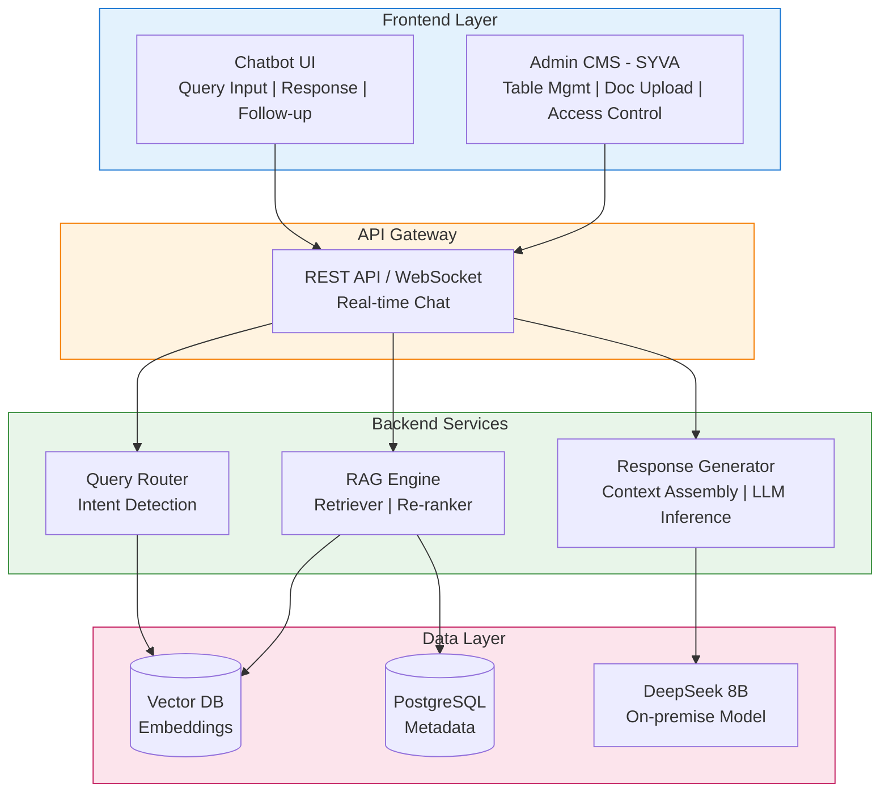

# Product Development Plan
## Macau University Library LLM Systems

**Project**: LLM-based Inquiry & Recommendation Systems  
**Client**: Macau University Library  
**Total Effort**: 65 man-days  
**Budget**: HK$180,000

---

## Executive Summary

This plan covers the development of two integrated LLM-based systems:
1. **System A**: Tabular Data Inquiry System (circulation, privileges, loans)
2. **System B**: Reference Material Recommendation System (theses, books, papers)

Both systems share a common infrastructure using DeepSeek-R1-Distill-Llama 8B deployed on-premise via Docker, with SYVA Platform as the CMS layer.

---

## Product Architecture Overview


### Architecture Diagram (Mermaid)



---

## PART 1: DEVELOPMENT TEAM PLAN

### Sprint Breakdown (Recommended: 2-week sprints)

---

### Sprint 1-2: Infrastructure & Foundation (10 days)

#### Deliverables

| Task | Owner | Days | Priority |
|------|-------|------|----------|
| Docker environment setup | DevOps | 2 | P0 |
| DeepSeek 8B model installation & testing | ML Engineer | 3 | P0 |
| SYVA Platform installation & config | Backend | 2 | P0 |
| Database schema design (PostgreSQL) | Backend | 1.5 | P0 |
| Vector DB setup (ChromaDB/Qdrant) | Backend | 1.5 | P1 |

#### Technical Specifications

**Docker Compose Structure:**
```yaml
services:
  deepseek-llm:
    image: deepseek-r1-distill-llama-8b
    deploy:
      resources:
        reservations:
          devices:
            - capabilities: [gpu]
    ports:
      - "8080:8080"
    
  vector-db:
    image: qdrant/qdrant
    ports:
      - "6333:6333"
    volumes:
      - vector_data:/qdrant/storage
      
  postgres:
    image: postgres:15
    environment:
      POSTGRES_DB: macau_library
    volumes:
      - pg_data:/var/lib/postgresql/data
      
  backend-api:
    build: ./backend
    depends_on:
      - deepseek-llm
      - vector-db
      - postgres
```

**Database Schema (Core Tables):**
```sql
-- Library tabular data (System A)
CREATE TABLE library_tables (
    id SERIAL PRIMARY KEY,
    table_name VARCHAR(255) NOT NULL,
    table_type VARCHAR(50), -- circulation, privileges, loans, resources
    original_data JSONB,
    normalized_data JSONB,
    embedding_id VARCHAR(255),
    created_at TIMESTAMP DEFAULT NOW(),
    updated_at TIMESTAMP DEFAULT NOW()
);

-- Academic materials (System B)
CREATE TABLE academic_materials (
    id SERIAL PRIMARY KEY,
    title VARCHAR(500) NOT NULL,
    material_type VARCHAR(50), -- thesis, book, paper
    authors TEXT[],
    abstract TEXT,
    keywords TEXT[],
    metadata JSONB,
    embedding_id VARCHAR(255),
    created_at TIMESTAMP DEFAULT NOW()
);

-- Query logs for improvement
CREATE TABLE query_logs (
    id SERIAL PRIMARY KEY,
    user_id VARCHAR(255),
    query_text TEXT,
    system_type CHAR(1), -- A or B
    response TEXT,
    feedback_score INTEGER,
    created_at TIMESTAMP DEFAULT NOW()
);
```

#### Acceptance Criteria
- [ ] All Docker containers start successfully
- [ ] DeepSeek model responds to test prompts < 5 seconds
- [ ] SYVA admin panel accessible
- [ ] Database migrations complete

---

### Sprint 3-4: System A - Tabular Data Pipeline (12 days)

#### Deliverables

| Task | Owner | Days | Priority |
|------|-------|------|----------|
| Table extraction & normalization scripts | Backend | 3 | P0 |
| Table preprocessing pipeline | ML Engineer | 2 | P0 |
| Hybrid reasoning module | ML Engineer | 3 | P0 |
| Query-to-structure translator | Backend | 2 | P1 |
| Table CRUD API endpoints | Backend | 2 | P1 |

#### Technical Implementation

**Table Preprocessing Pipeline:**
```python
# /backend/services/table_processor.py

class TableProcessor:
    """
    Normalizes and structures library tabular data for LLM consumption
    """
    
    def normalize_table(self, raw_table: dict) -> dict:
        """
        Steps:
        1. Flatten multi-level headers
        2. Separate mixed data types into columns
        3. Standardize column names (snake_case)
        4. Handle merged cells
        5. Convert to consistent format
        """
        pass
    
    def generate_table_description(self, table: dict) -> str:
        """
        Creates natural language description of table structure
        for LLM context injection
        """
        pass
    
    def create_lookup_index(self, table: dict) -> dict:
        """
        Creates inverted index for fast lookup operations
        """
        pass
```

**Hybrid Reasoning Architecture:**
```python
# /backend/services/hybrid_reasoner.py

class HybridReasoner:
    """
    Combines LLM understanding with symbolic reasoning
    """
    
    def process_query(self, query: str, tables: list) -> dict:
        # Step 1: Intent classification
        intent = self.classify_intent(query)
        
        # Step 2: Entity extraction
        entities = self.extract_entities(query)
        
        # Step 3: Symbolic lookup (for exact matches)
        if intent in ['lookup', 'comparison']:
            symbolic_result = self.symbolic_lookup(entities, tables)
            
        # Step 4: LLM reasoning (for complex queries)
        llm_context = self.build_context(query, tables, symbolic_result)
        llm_response = self.llm_inference(llm_context)
        
        # Step 5: Merge and validate
        return self.merge_results(symbolic_result, llm_response)
```

#### API Endpoints (System A)
```
POST   /api/v1/tables                    # Upload/create table
GET    /api/v1/tables                    # List all tables
GET    /api/v1/tables/{id}               # Get specific table
PUT    /api/v1/tables/{id}               # Update table
DELETE /api/v1/tables/{id}               # Delete table
POST   /api/v1/tables/query              # Natural language query
POST   /api/v1/tables/batch-import       # Bulk import tables
```

#### Test Cases
```python
# Example test queries for validation
test_queries = [
    "What is the loan period for PhD students?",
    "Can undergraduate students borrow journals?",
    "Compare borrowing limits between staff and students",
    "How many items can a visiting scholar borrow?",
    "What are the overdue penalties for reserve materials?"
]
```

---

### Sprint 5-6: System B - RAG Recommendation Engine (12 days)

#### Deliverables

| Task | Owner | Days | Priority |
|------|-------|------|----------|
| Document ingestion pipeline | Backend | 2 | P0 |
| Embedding generation service | ML Engineer | 2 | P0 |
| Vector similarity search | Backend | 2 | P0 |
| RAG retrieval module | ML Engineer | 3 | P0 |
| Recommendation API endpoints | Backend | 2 | P1 |
| Explanation generator | ML Engineer | 1 | P2 |

#### Technical Implementation

**Document Ingestion Pipeline:**
```python
# /backend/services/document_ingestion.py

class DocumentIngestion:
    """
    Processes up to 300 documents for recommendation system
    """
    
    def __init__(self):
        self.embedding_model = SentenceTransformer('all-MiniLM-L6-v2')
        self.vector_db = QdrantClient()
        
    def process_document(self, doc: dict) -> dict:
        # 1. Extract metadata
        metadata = self.extract_metadata(doc)
        
        # 2. Clean and chunk content
        chunks = self.chunk_content(doc['content'], chunk_size=512)
        
        # 3. Generate embeddings
        embeddings = self.embedding_model.encode(chunks)
        
        # 4. Store in vector DB
        self.vector_db.upsert(
            collection_name="academic_materials",
            points=[
                PointStruct(
                    id=f"{doc['id']}_{i}",
                    vector=emb.tolist(),
                    payload={"doc_id": doc['id'], "chunk": chunk, **metadata}
                )
                for i, (emb, chunk) in enumerate(zip(embeddings, chunks))
            ]
        )
        
    def batch_process(self, documents: list):
        """Process up to 300 documents"""
        for doc in tqdm(documents):
            self.process_document(doc)
```

**RAG Pipeline:**
```python
# /backend/services/rag_engine.py

class RAGEngine:
    """
    Retrieval-Augmented Generation for recommendations
    """
    
    def __init__(self):
        self.retriever = VectorRetriever()
        self.reranker = CrossEncoderReranker()
        self.llm = DeepSeekClient()
        
    def recommend(self, query: str, top_k: int = 5) -> list:
        # 1. Initial retrieval (top 20)
        candidates = self.retriever.search(query, k=20)
        
        # 2. Re-rank with cross-encoder
        reranked = self.reranker.rerank(query, candidates, k=top_k)
        
        # 3. Generate recommendations with explanations
        prompt = self.build_recommendation_prompt(query, reranked)
        response = self.llm.generate(prompt)
        
        return self.parse_recommendations(response)
    
    def build_recommendation_prompt(self, query: str, docs: list) -> str:
        return f"""Based on the user's research interest: "{query}"

Recommend the most relevant academic materials from the following candidates:
{self.format_candidates(docs)}

For each recommendation:
1. Explain WHY it's relevant to the query
2. Highlight key topics/methods that match
3. Suggest how it might be useful

Provide recommendations in order of relevance."""
```

#### API Endpoints (System B)
```
POST   /api/v1/materials                     # Add material
GET    /api/v1/materials                     # List materials
POST   /api/v1/materials/bulk-import         # Bulk import (max 300)
POST   /api/v1/recommend                     # Get recommendations
POST   /api/v1/recommend/explain             # Get recommendation with explanation
GET    /api/v1/recommend/similar/{id}        # Find similar materials
```

---

### Sprint 7-8: Integration & Chatbot Backend (10 days)

#### Deliverables

| Task | Owner | Days | Priority |
|------|-------|------|----------|
| Unified query router | Backend | 2 | P0 |
| Conversation state management | Backend | 2 | P0 |
| WebSocket real-time chat | Backend | 2 | P0 |
| User authentication integration | Backend | 2 | P1 |
| Access control implementation | Backend | 2 | P1 |

#### Conversation Flow
```python
# /backend/services/conversation_manager.py

class ConversationManager:
    """
    Manages multi-turn conversations with context
    """
    
    def __init__(self):
        self.sessions = {}  # In-memory or Redis
        
    def process_message(self, session_id: str, message: str) -> dict:
        # Get or create session
        session = self.get_session(session_id)
        
        # Classify intent and route
        intent = self.classify_intent(message, session.context)
        
        if intent['system'] == 'A':
            response = self.table_inquiry.process(message, session.context)
        elif intent['system'] == 'B':
            response = self.recommendation.process(message, session.context)
        else:
            response = self.general_response(message)
            
        # Update context
        session.add_turn(message, response)
        
        return {
            "response": response,
            "follow_up_suggestions": self.generate_suggestions(session),
            "sources": response.get("sources", [])
        }
```

---

### Sprint 9-10: Testing, Fine-tuning & Deployment (11 days)

#### Deliverables

| Task | Owner | Days | Priority |
|------|-------|------|----------|
| Unit & integration tests | All | 2 | P0 |
| Performance benchmarking | DevOps | 1 | P0 |
| LLM fine-tuning on library data | ML Engineer | 3 | P1 |
| UAT environment setup | DevOps | 1 | P0 |
| Production deployment | DevOps | 2 | P0 |
| Documentation | All | 2 | P1 |

#### Benchmark Dataset Structure
```json
{
  "system_a_benchmarks": [
    {
      "query": "What's the loan period for faculty members?",
      "expected_answer": "28 days",
      "table_source": "circulation_policies",
      "difficulty": "easy"
    },
    {
      "query": "Compare renewal limits between postgrad and undergrad",
      "expected_answer": "Postgrad: 3 renewals, Undergrad: 2 renewals",
      "table_source": "user_privileges",
      "difficulty": "medium"
    }
  ],
  "system_b_benchmarks": [
    {
      "query": "Papers about machine learning in education",
      "expected_materials": ["doc_001", "doc_015", "doc_042"],
      "relevance_threshold": 0.7
    }
  ]
}
```

---

## PART 2: UX TEAM PLAN

### Design Sprints Aligned with Development

---

### UX Sprint 1: Research & Information Architecture (Week 1-2)

#### Deliverables

| Task | Owner | Days | Priority |
|------|-------|------|----------|
| User research (library staff interviews) | UX Researcher | 2 | P0 |
| Persona development | UX Designer | 1 | P0 |
| User journey mapping | UX Designer | 1.5 | P0 |
| Information architecture | UX Designer | 1.5 | P0 |
| Competitive analysis | UX Researcher | 1 | P1 |

#### Key Personas

**Persona 1: Student Researcher (Sarah)**
- Year 3 undergraduate
- Needs: Quick answers about borrowing policies, material recommendations for thesis
- Pain points: Complex library website, unclear privilege information
- Tech comfort: High

**Persona 2: Library Staff (Michael)**
- Circulation desk supervisor
- Needs: Manage tables, answer patron questions quickly
- Pain points: Updating policy tables, explaining rules to students
- Tech comfort: Medium

**Persona 3: Faculty Member (Dr. Wong)**
- Associate Professor
- Needs: Find relevant research papers, understand borrowing privileges
- Pain points: Time-consuming literature search
- Tech comfort: Medium-High

#### User Journey Map (Student Research Flow)
```
┌─────────┐   ┌──────────┐   ┌─────────────┐   ┌────────────┐   ┌─────────┐
│ Trigger │ → │ Discover │ → │ Query       │ → │ Evaluate   │ → │ Action  │
│         │   │          │   │             │   │            │   │         │
│ Need to │   │ Find     │   │ Ask natural │   │ Review     │   │ Borrow/ │
│ find    │   │ chatbot  │   │ language    │   │ results &  │   │ Access  │
│ papers  │   │ on site  │   │ question    │   │ explanations│   │ materials│
└─────────┘   └──────────┘   └─────────────┘   └────────────┘   └─────────┘
     │              │              │                  │              │
     ▼              ▼              ▼                  ▼              ▼
  Emotions:    Curious/       Hopeful/            Satisfied/      Accomplished
  Frustrated   Interested     Uncertain           Informed
```

---

### UX Sprint 2: Wireframing & Prototyping (Week 3-4)

#### Deliverables

| Task | Owner | Days | Priority |
|------|-------|------|----------|
| Chatbot wireframes (mobile + desktop) | UX Designer | 2 | P0 |
| Admin CMS wireframes | UX Designer | 2 | P0 |
| Interactive prototype | UX Designer | 2 | P0 |
| Design system foundation | UI Designer | 2 | P1 |

#### Chatbot Interface Wireframes

**Draft Mockups (Stitch):** [View Interactive Prototype](https://stitch.withgoogle.com/projects/8323273447344960411?pli=1)


**Main Chat View (Desktop)**
```
┌────────────────────────────────────────────────────────────────────┐
│ ┌────────────────────────────────────────────────────────────────┐ │
│ │  🎓 Macau University Library Assistant              [−][□][×] │ │
│ └────────────────────────────────────────────────────────────────┘ │
│                                                                    │
│ ┌────────────────────────────────────────────────────────────────┐ │
│ │                                                                │ │
│ │  👋 Hello! I can help you with:                               │ │
│ │                                                                │ │
│ │  📊 Library policies & borrowing information                  │ │
│ │  📚 Academic material recommendations                         │ │
│ │                                                                │ │
│ │  What would you like to know today?                           │ │
│ │                                                                │ │
│ └────────────────────────────────────────────────────────────────┘ │
│                                                                    │
│ ┌────────────────────────────────────────────────────────────────┐ │
│ │  💬 User: How many books can I borrow as a PhD student?       │ │
│ └────────────────────────────────────────────────────────────────┘ │
│                                                                    │
│ ┌────────────────────────────────────────────────────────────────┐ │
│ │  🤖 Assistant:                                                 │ │
│ │                                                                │ │
│ │  As a PhD student, you can borrow up to **30 items** at a    │ │
│ │  time with a loan period of **28 days**.                      │ │
│ │                                                                │ │
│ │  ┌──────────────────────────────────────────┐                 │ │
│ │  │ 📋 Source: User Privileges Table         │                 │ │
│ │  │ Updated: Jan 2025                        │                 │ │
│ │  └──────────────────────────────────────────┘                 │ │
│ │                                                                │ │
│ │  Would you like to know about renewals or reserves?           │ │
│ │                                                                │ │
│ │  [Renewals] [Reserves] [Other privileges]                     │ │
│ │                                                                │ │
│ └────────────────────────────────────────────────────────────────┘ │
│                                                                    │
│ ┌────────────────────────────────────────────────────────────────┐ │
│ │  [Type your question here...]                         [Send]  │ │
│ └────────────────────────────────────────────────────────────────┘ │
└────────────────────────────────────────────────────────────────────┘
```

**Recommendation Response View**
```
┌────────────────────────────────────────────────────────────────────┐
│  💬 User: Find papers about deep learning in medical imaging      │
└────────────────────────────────────────────────────────────────────┘

┌────────────────────────────────────────────────────────────────────┐
│  🤖 I found 5 relevant materials for your research:               │
│                                                                    │
│  ┌──────────────────────────────────────────────────────────────┐ │
│  │ 📄 1. "Deep Learning for Medical Image Analysis"             │ │
│  │    Authors: Chen et al. (2023)                               │ │
│  │    Type: Thesis | Relevance: ★★★★★                          │ │
│  │                                                               │ │
│  │    WHY RELEVANT: This thesis directly addresses CNN          │ │
│  │    architectures for radiology imaging, matching your        │ │
│  │    interest in medical applications.                         │ │
│  │                                                               │ │
│  │    [View Details] [Add to Reading List]                      │ │
│  └──────────────────────────────────────────────────────────────┘ │
│                                                                    │
│  ┌──────────────────────────────────────────────────────────────┐ │
│  │ 📄 2. "Transfer Learning in Diagnostic Systems"              │ │
│  │    Authors: Wong & Liu (2024)                                │ │
│  │    Type: Journal Article | Relevance: ★★★★☆                 │ │
│  │    ...                                                        │ │
│  └──────────────────────────────────────────────────────────────┘ │
│                                                                    │
│  [Load more results]                                               │
│                                                                    │
│  Related questions:                                                │
│  • "Narrow to COVID-19 imaging"                                   │
│  • "Include papers from 2023 only"                                │
│  • "Show similar theses"                                          │
└────────────────────────────────────────────────────────────────────┘
```

**Admin CMS - Table Management**
```
┌────────────────────────────────────────────────────────────────────┐
│  SYVA Admin │ Tables │ Documents │ Users │ Analytics │ Settings   │
├────────────────────────────────────────────────────────────────────┤
│                                                                    │
│  📊 Library Tables                              [+ Add New Table]  │
│                                                                    │
│  ┌──────────────────────────────────────────────────────────────┐ │
│  │ Search tables...                          [Filter ▼] [Sort ▼]│ │
│  └──────────────────────────────────────────────────────────────┘ │
│                                                                    │
│  ┌─────────────────────────────────────────────────────────────┐  │
│  │ Table Name          │ Type        │ Last Updated │ Actions  │  │
│  ├─────────────────────┼─────────────┼──────────────┼──────────┤  │
│  │ Circulation Policy  │ Policies    │ Jan 15, 2025 │ [✏️][👁️][🗑️]│  │
│  │ User Privileges     │ Privileges  │ Jan 10, 2025 │ [✏️][👁️][🗑️]│  │
│  │ Loan Periods        │ Loans       │ Jan 8, 2025  │ [✏️][👁️][🗑️]│  │
│  │ Resource Limits     │ Resources   │ Dec 28, 2024 │ [✏️][👁️][🗑️]│  │
│  └─────────────────────┴─────────────┴──────────────┴──────────┘  │
│                                                                    │
│  Showing 4 of 10 tables                            [< 1 2 3 >]    │
└────────────────────────────────────────────────────────────────────┘
```

---

### UX Sprint 3: Visual Design & Components (Week 5-6)

#### Deliverables

| Task | Owner | Days | Priority |
|------|-------|------|----------|
| Visual design system | UI Designer | 3 | P0 |
| Chat UI components | UI Designer | 2 | P0 |
| Admin UI components | UI Designer | 2 | P1 |
| Responsive design specs | UI Designer | 1 | P0 |
| Design handoff documentation | UI Designer | 1 | P1 |

#### Design System Specifications

**Color Palette**
```
Primary:     #1E3A5F (Deep Navy - Library/Academic)
Secondary:   #2E7D32 (Forest Green - Success)
Accent:      #F57C00 (Amber - Highlights)
Background:  #F5F5F5 (Light Gray)
Surface:     #FFFFFF (White)
Text:        #212121 (Near Black)
Text Light:  #757575 (Gray)
Error:       #D32F2F (Red)
```

**Typography**
```
Headings:    Inter (Bold)
Body:        Inter (Regular)
Code/Tables: Roboto Mono

H1: 24px / 32px line-height
H2: 20px / 28px line-height
Body: 16px / 24px line-height
Caption: 14px / 20px line-height
```

**Chat Components**
```
- Message bubble (user): Right-aligned, Primary color
- Message bubble (assistant): Left-aligned, Surface color with border
- Quick action chips: Rounded, Accent color outline
- Source citation cards: Surface with left border (Primary)
- Loading indicator: Typing animation (3 dots)
```

---

### UX Sprint 4: Usability Testing & Refinement (Week 7-8)

#### Deliverables

| Task | Owner | Days | Priority |
|------|-------|------|----------|
| Usability test planning | UX Researcher | 1 | P0 |
| User testing sessions (5 users) | UX Researcher | 2 | P0 |
| Analysis & recommendations | UX Researcher | 1 | P0 |
| Design iterations | UI Designer | 2 | P0 |
| Final design specs | UI Designer | 1 | P0 |

#### Usability Test Script (Key Tasks)

**Task 1: Policy Inquiry**
> "You're a new PhD student and want to know how many books you can borrow. Use the chatbot to find out."

Success Criteria:
- [ ] User finds chatbot within 30 seconds
- [ ] User formulates question naturally
- [ ] User understands the response
- [ ] User can find source information

**Task 2: Material Recommendation**
> "You're writing a thesis on AI in healthcare. Ask the assistant to recommend relevant papers."

Success Criteria:
- [ ] User successfully requests recommendations
- [ ] User understands why materials are recommended
- [ ] User can take action on recommendations (view details, save)

**Task 3: Follow-up Question**
> "After getting the borrowing limit, ask about renewals without repeating context."

Success Criteria:
- [ ] System maintains conversation context
- [ ] User feels the interaction is natural

---

## PART 3: INTEGRATED TIMELINE

```
Week  | 1  | 2  | 3  | 4  | 5  | 6  | 7  | 8  | 9  | 10 |
------|----|----|----|----|----|----|----|----|----|----|
DEV   |███████ Infrastructure ██████|                    
      |         |███████ System A - Tables ██████|       
      |              |███████ System B - RAG █████████|  
      |                   |█████ Integration █████|      
      |                             |██ Test/Deploy ███| 
------|----|----|----|----|----|----|----|----|----|----|
UX    |██ Research ██|                                   
      |    |███ Wireframes ███|                          
      |              |███ Visual Design ███|             
      |                        |██ Testing ██|           
------|----|----|----|----|----|----|----|----|----|----|
```

---

## PART 4: KEY DELIVERABLES CHECKLIST

### Development Deliverables
- [ ] Docker deployment package
- [ ] DeepSeek 8B model configuration
- [ ] SYVA platform setup
- [ ] Table preprocessing pipeline
- [ ] RAG recommendation engine
- [ ] REST API documentation
- [ ] WebSocket chat service
- [ ] Admin API for CRUD operations
- [ ] User authentication module
- [ ] Unit & integration tests
- [ ] Performance benchmark results
- [ ] Deployment runbook

### UX Deliverables
- [ ] User personas (3)
- [ ] User journey maps (3 flows)
- [ ] Information architecture diagram
- [ ] Wireframes (mobile + desktop)
- [ ] Interactive prototype
- [ ] Design system documentation
- [ ] Component library
- [ ] Usability test report
- [ ] Final design specifications
- [ ] Developer handoff package

---

## PART 5: RISK REGISTER

| Risk | Impact | Likelihood | Mitigation |
|------|--------|------------|------------|
| LLM accuracy on complex tables | High | Medium | Hybrid reasoning + fine-tuning |
| Document volume exceeds 300 | Medium | Low | Batch processing, pagination |
| Integration with SYVA delays | High | Medium | Early setup, backup plan |
| User adoption resistance | Medium | Medium | Training sessions, gradual rollout |
| GPU memory constraints | High | Low | Model quantization, batching |

---

## PART 6: SUCCESS METRICS

### System A (Tabular Inquiry)
- Query accuracy: ≥ 90%
- Response time: < 3 seconds
- User satisfaction: ≥ 4.0/5.0

### System B (Recommendations)
- Recommendation relevance: ≥ 80% (user feedback)
- Click-through rate: ≥ 30%
- Return user rate: ≥ 50%

### Overall
- UAT pass rate: 100% critical, 90% all
- System uptime: ≥ 99%
- Training completion: 100% staff

---

## APPENDIX A: Tech Stack Summary

| Component | Technology |
|-----------|------------|
| LLM | DeepSeek-R1-Distill-Llama 8B |
| Vector DB | Qdrant or ChromaDB |
| Database | PostgreSQL 15 |
| Backend | Python 3.11 + FastAPI |
| Frontend | React 18 + TypeScript |
| CMS | SYVA Platform |
| Deployment | Docker + Docker Compose |
| Embedding | sentence-transformers |

---

## APPENDIX B: API Contract Summary

```yaml
openapi: 3.0.0
info:
  title: Macau Library LLM API
  version: 1.0.0

paths:
  /api/v1/chat:
    post:
      summary: Send chat message
      requestBody:
        content:
          application/json:
            schema:
              type: object
              properties:
                session_id: string
                message: string
      responses:
        200:
          description: Chat response
          
  /api/v1/tables/query:
    post:
      summary: Query tabular data
      
  /api/v1/recommend:
    post:
      summary: Get material recommendations
```

---

*Document Version: 1.0*  
*Created: Based on Macau U Proposal v_Revised_06022025*  
*Status: Ready for Team Review*
****
