# KnowledgeFactory: Current vs Future Architecture

> **Visual comparison of KnowledgeFactory's evolution**
>
> Clean, readable diagrams showing the transformation from text-centric to multi-modal platform.

---

## Diagram 1: Current State - KnowledgeFactory Today

```mermaid
flowchart LR
    subgraph INPUT["📥 INPUT SOURCES"]
        A1["🎥 YouTube"]
        A2["💻 GitHub"]
        A3["🌐 Web Articles"]
        A4["💡 Ideas"]
        A5["📸 Screenshots"]
    end
    
    subgraph PROCESS["⚙️ PROCESSING"]
        B1["Claude Code<br/>CLI"]
        B2["MCP Gateway"]
        B3["4 MCP Servers<br/>GitHub | YouTube<br/>Firecrawl | Obsidian"]
        B4["AI Auto-Tagging<br/>6-8 Tags"]
    end
    
    subgraph STORE["💾 STORAGE"]
        C1["Obsidian Vault"]
        C2["Markdown Files"]
        C3["Images Folder"]
        C4["Git Version Control"]
        C5["Smart Connections<br/>Templater<br/>Terminal"]
    end
    
    subgraph PUBLISH["🚀 PUBLISHING"]
        D1["/publish<br/>Command"]
        D2["Sharehub<br/>Jekyll"]
        D3["GitHub Pages"]
        D4["3-Tier Access<br/>Private | Password | Public"]
    end
    
    A1 & A2 & A3 & A4 & A5 --> B1
    B1 --> B2
    B2 --> B3
    B3 --> B4
    B4 --> C1
    C1 --> C2 & C3 & C4
    C1 <--> C5
    C1 --> D1
    D1 --> D2
    D2 --> D3
    D3 --> D4
    
    classDef inputStyle fill:#E3F2FD,stroke:#1976D2,stroke-width:2px
    classDef processStyle fill:#F3E5F5,stroke:#7B1FA2,stroke-width:2px
    classDef storeStyle fill:#E8F5E9,stroke:#388E3C,stroke-width:2px
    classDef publishStyle fill:#FFF3E0,stroke:#F57C00,stroke-width:2px
    
    class A1,A2,A3,A4,A5 inputStyle
    class B1,B2,B3,B4 processStyle
    class C1,C2,C3,C4,C5 storeStyle
    class D1,D2,D3,D4 publishStyle
```



### Current Capabilities Summary

| Layer | Components | Count |
|-------|------------|-------|
| **Input** | YouTube, GitHub, Web, Ideas, Screenshots | 5 sources |
| **Processing** | Claude Code + 4 MCP Servers | AI tagging |
| **Storage** | Obsidian + Git + Enhancements | Local-first |
| **Publishing** | Sharehub → GitHub Pages | 1 platform |

---

## Diagram 2: Future Vision - Multi-Modal Knowledge Platform

```mermaid
flowchart LR
    subgraph INPUT["📥 EXPANDED INPUTS"]
        direction TB
        A1["🎥 Video<br/>YouTube | Analysis"]
        A2["💻 Code<br/>GitHub | Git"]
        A3["🌐 Web<br/>Articles | Docs"]
        A4["🖼️ Visual<br/>Images | OCR"]
        A5["🎤 Audio<br/>Podcasts | Speech"]
        A6["📄 Documents<br/>PDF | Email"]
        A7["📊 Data<br/>DB | Social"]
    end
    
    subgraph PROCESS["⚙️ MULTI-MODAL AI"]
        direction TB
        B1["Claude Code<br/>Orchestrator"]
        B2["9 MCP Servers<br/>Core + New"]
        B3["AI Processing<br/>OCR | STT | CV | NLP"]
        B4["Smart Tagging<br/>Multi-Modal"]
    end
    
    subgraph STORE["💾 INTELLIGENT STORAGE"]
        direction TB
        C1["Obsidian<br/>Vault"]
        C2["Vector<br/>Database"]
        C3["Knowledge<br/>Graph"]
        C4["Media<br/>Library"]
    end
    
    subgraph OUTPUT["✨ CREATIVE OUTPUTS"]
        direction TB
        D1["📊 Diagrams<br/>Mermaid | PlantUML"]
        D2["📝 Documents<br/>DOCX | XLSX | PPTX"]
        D3["📈 Business<br/>Dashboards | Kanban"]
        D4["🎨 Media<br/>Images | Videos"]
    end
    
    subgraph PUBLISH["🚀 MULTI-PLATFORM"]
        direction TB
        E1["GitHub<br/>Pages"]
        E2["Medium<br/>Blog"]
        E3["WordPress<br/>Site"]
        E4["Social<br/>APIs"]
    end
    
    A1 & A2 & A3 --> B1
    A4 & A5 & A6 & A7 --> B3
    B3 --> B1
    B1 --> B2
    B2 --> B4
    B4 --> C1
    C1 --> C2 & C3 & C4
    C1 --> D1 & D2 & D3 & D4
    D1 & D2 & D3 --> E1
    D4 --> E2 & E3 & E4
    
    classDef inputStyle fill:#E3F2FD,stroke:#1976D2,stroke-width:2px
    classDef processStyle fill:#F3E5F5,stroke:#7B1FA2,stroke-width:2px
    classDef storeStyle fill:#E8F5E9,stroke:#388E3C,stroke-width:2px
    classDef outputStyle fill:#FFF9C4,stroke:#F9A825,stroke-width:2px
    classDef publishStyle fill:#FFEBEE,stroke:#C62828,stroke-width:2px
    
    class A1,A2,A3,A4,A5,A6,A7 inputStyle
    class B1,B2,B3,B4 processStyle
    class C1,C2,C3,C4 storeStyle
    class D1,D2,D3,D4 outputStyle
    class E1,E2,E3,E4 publishStyle
```



### Future Capabilities Summary

| Layer | Components | Count |
|-------|------------|-------|
| **Input** | Video, Code, Web, Visual, Audio, Docs, Data | 12 sources |
| **Processing** | Multi-modal AI (OCR, STT, CV, NLP) + 9 MCP | Advanced |
| **Storage** | Obsidian + Vector DB + Graph + Media | Intelligent |
| **Output** | Diagrams, Docs, Business, Media | 10+ formats |
| **Publishing** | GitHub, Medium, WordPress, Social | 5+ platforms |

---

## Key Evolution Metrics

### 📊 Quantitative Changes

| Dimension | Current | Future | Growth |
|-----------|---------|--------|--------|
| **Input Sources** | 5 | 12 | **+140%** |
| **MCP Servers** | 4 | 9+ | **+125%** |
| **Storage Types** | 1 | 4 | **+300%** |
| **Output Formats** | 1 | 10+ | **+900%** |
| **Publishing Platforms** | 1 | 5+ | **+400%** |

### 🔄 Qualitative Transformations

**Input Evolution:**
- **From:** Text-only (articles, transcripts, code)
- **To:** Multi-modal (text, images, audio, video, data)

**Processing Evolution:**
- **From:** Text analysis + tagging
- **To:** OCR, Speech-to-Text, Computer Vision, NLP

**Storage Evolution:**
- **From:** File system
- **To:** Vector DB + Knowledge Graph + Media Library

**Output Evolution:**
- **From:** Markdown → HTML
- **To:** Professional documents, diagrams, dashboards, media

**Publishing Evolution:**
- **From:** Single static site
- **To:** Multi-platform distribution with APIs

---

## Implementation Roadmap

### Phase 1: Visual Processing (Q1 2025)
```
🎯 Goal: Add image and visual content processing
└── Add Vision Analysis MCP
└── Implement OCR capabilities  
└── Create visual templates
└── Test with screenshots/diagrams
```

### Phase 2: Audio/Video (Q2 2025)
```
🎯 Goal: Enable audio and video content capture
└── Add Whisper API MCP
└── Implement video analysis
└── Build multimedia templates
└── Test with podcasts/meetings
```

### Phase 3: Creative Outputs (Q3 2025)
```
🎯 Goal: Generate professional documents and diagrams
└── Add Mermaid/PlantUML rendering
└── Implement DOCX/XLSX/PPTX export
└── Build dashboard tools
└── Test with real content
```

### Phase 4: Multi-Platform (Q4 2025)
```
🎯 Goal: Expand publishing to multiple platforms
└── Integrate Medium API
└── Add WordPress connector
└── Implement social automation
└── Test full pipeline
```

---

## Architecture Principles

Both architectures follow these core principles:

1. **🧩 Modular Design**
   - MCP servers as pluggable components
   - Add/remove capabilities without core changes

2. **🤖 AI-First Processing**
   - Automated tagging and analysis
   - Minimal manual intervention required

3. **🏠 Local-First Storage**
   - Obsidian vault as source of truth
   - Full control over data

4. **📜 Version Controlled**
   - Git tracks all changes
   - Enable collaboration and history

5. **🔒 Privacy-Aware**
   - Three-tier access control
   - You control what gets published

6. **🔌 API-First Integration**
   - MCP protocol for extensibility
   - Easy to add new capabilities

---

## Comparison: Now vs Future

### What Stays the Same ✅
- Obsidian as core knowledge vault
- Git version control
- AI-powered automation
- Three-tier publishing model
- MCP-based architecture

### What Gets Better 📈
- **2.4x more input sources** (5 → 12)
- **Multi-modal AI processing** (text-only → text/image/audio/video)
- **10x more output formats** (1 → 10+)
- **5x more publishing platforms** (1 → 5+)
- **Intelligent storage** (files → vectors + graphs)

### What Stays Simple 🎯
- One command to capture: `/capture`
- One command to publish: `/publish`
- One interface: Obsidian + Terminal
- One workflow: Capture → Process → Store → Share

---

## Technical Stack Evolution

### Current Stack
```
Frontend:     Obsidian (local)
CLI:          Claude Code
Protocol:     MCP
Servers:      4 core (GitHub, YouTube, Firecrawl, Obsidian)
Storage:      File system + Git
Processing:   Text analysis + AI tagging
Output:       Markdown
Publishing:   Jekyll + GitHub Pages
```

### Future Stack
```
Frontend:     Obsidian (local)
CLI:          Claude Code
Protocol:     MCP
Servers:      9+ (core + vision + audio + data)
Storage:      File system + Vector DB + Graph + Media
Processing:   Multi-modal AI (OCR + STT + CV + NLP)
Output:       Markdown + DOCX/XLSX/PPTX + Diagrams + Media
Publishing:   Jekyll + Medium + WordPress + Social APIs
```

---

## Conclusion

KnowledgeFactory's evolution represents a transformation from a **text-centric capture tool** to a **multi-modal knowledge creation platform**:

- **Capture anything:** Text, images, audio, video, data
- **Process intelligently:** Multi-modal AI understanding
- **Store richly:** Vectors, graphs, and relationships
- **Create professionally:** Documents, diagrams, dashboards
- **Publish everywhere:** Multiple platforms and formats

All powered by the **MCP ecosystem**, ensuring modular growth without breaking existing workflows.

**The core promise remains:** Automated, AI-powered knowledge management that scales with you. 🚀

---

*Architecture diagrams created: 2025-11-11*
*Document type: System Evolution Reference*
*Status: Active Development*
