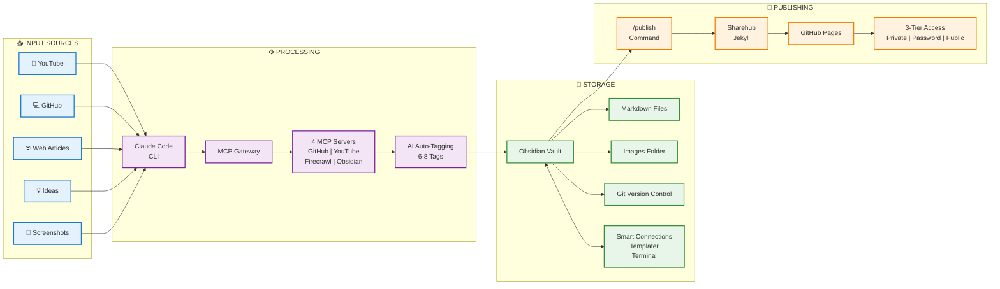
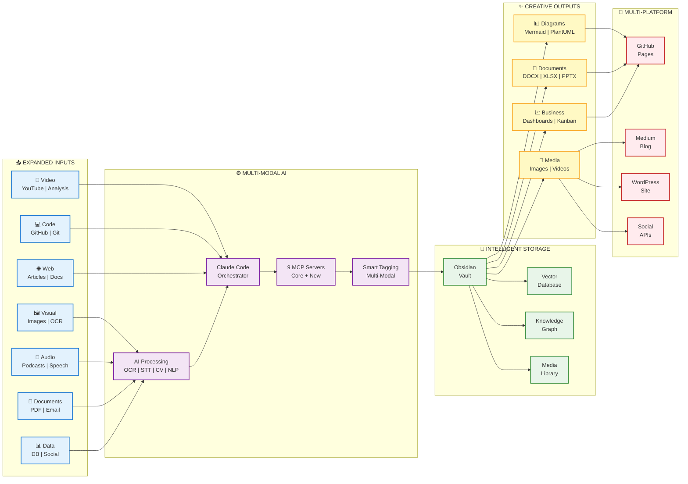

# KnowledgeFactory: Current vs Future Architecture

> **Visual comparison of KnowledgeFactory's evolution**
>
> Clean, readable diagrams showing the transformation from text-centric to multi-modal platform.

---

## Diagram 1: Current State - KnowledgeFactory Today



> **Interactive Mindmap:** [Open in Mermaid Chart Editor](https://www.mermaidchart.com/play?utm_source=mermaid_mcp_server&utm_medium=remote_server&utm_campaign=claude#pako:eNplVbGO4zYQ_ZXBFsFdEaQMkAABZNneNc5eC5bsywFpRuScRSxFCiNqbSdIl_KAOyDpN80haVMlf5X9hNBeiKKcwoWGj5yZ996Mf7oRVtLNNze1MrLG5gcDwNa6V6-en_74HdaTfDFdJPewS7bL4gvtvi35q-8yVo_oCN4Ye9Ak9wQTbOn16_NlgOenXz9DmmTFdjPrbyxM0zkorNXtCwjgne2KriRYpVkfAtgpSRYKRtMKVo0L6Fvl7rpyDE595bChxgbUXDEJxoMeA99SCQk7JTQFaGqNo6P7eoycWtHVZBw6ZU0fzogbTUflTmNwsoCckEXVhzZ5DnMi2UaYzllYWaOc5T46q1HpAbIwpT1Cio3rmPpwrlE8DJiiYkLpmxCVegygpJPKRuRZJQjureu7fH76-Pe__3yEdLtJiqDFmvdo1I_hlVRj54lMFuOqvyxwP0TyGtnBEksaFCyobjQ6itqdW67RRdccdyLua86edw9xxANqRQ4lOhwiGduGvGLD28savc8Sg_rUqijj7OgYhfeWFzPSkc7-KUPabDqHDLmNsxZY6uvaw-eLEf-f7g2d3jPW8b1ckBkY__AX3G83sfe90wyJUNwtY1P59-kQ277tUMNSmYfo4Q3piw_bSjUhPPG-0Ne498RkRFxUql48PIiF-_jYy7a3rOIrhW2UCH389idMZ7vZcp31ffg0ygRGZzK2tJ8xVo4iWfxxMBiaR4wSTRiVaf3t-pqByJW56-QJbjuvQ8x1V3sjRjCApR9BE6r-BWa79XIXyF_5VM7_wrNUo_Gb4Gpyz6vDyBfGSUY-Uq2wj4Nr_BqCO3Wu_RQR5w34AGmFZh_XuiNuYwXO66Lbe8hIF4B7Olwrv20kRlP84RPkd8ngqKwrtWqrq92Y4Sj9BeT7HMnSVshUeTD7tRkKE9467WUjstXxEF7WfNQoYX2dIPjh2FiOJtBP3PBxV6yWEanr9PughxXKO39FUkXjXxzUeEOc-SG5CDJ6zlpNY8xlrXpkG6qYaLuHzLYuouWtZZmx7zdeP1J1obHzYf8PEDtPj504JXFW7Obn_wDlUyKU)

### Current Capabilities Summary

| Layer | Components | Count |
|-------|------------|-------|
| **Input** | YouTube, GitHub, Web, Ideas, Screenshots | 5 sources |
| **Processing** | Claude Code + 4 MCP Servers | AI tagging |
| **Storage** | Obsidian + Git + Enhancements | Local-first |
| **Publishing** | Sharehub → GitHub Pages | 1 platform |

---

## Diagram 2: Future Vision - Multi-Modal Knowledge Platform



> **Interactive Mindmap:** [Open in Mermaid Chart Editor](https://www.mermaidchart.com/play?utm_source=mermaid_mcp_server&utm_medium=remote_server&utm_campaign=claude#pako:eNptVE2LE0EQ_StFDrIbEPEbFITJJLsJTjZDMskqeOnMlEmzM91DTfcmq3jSo7CC3lcQ0asn_T3-Afcn2JMlk-meHAKh5lV11Xuv6m0rlgm2nrQyLpKM5a8EAEmpDg6ur358hVFnMugOvBOYedMgupWqp3O68ywkfs4UwnMhVykmC4QOK_DwsEwGuPvvz-Xf99_g-urzd_C9MJqOe9vMgci1gkjKtLgBA7TbL6WO9Bxh6Ift9jZcfpjxBCVExEQRE89Vsfvcbh9z1dfzZpJv5oEx5tJCH3HCmNgqbSac4hw8UjxO0UrxpVC4Vo-bGV0Z6wyFYopLUU8JkfIU11xdNJO8AUyQUbzchu9VPF3-Nn_Bn469qGJqRAsm-Bus9ZMybUbzBk5dreTtiC3s6CRjpCBgc0ytoSLM8tRoV9jwI0kZU04JRTpWmtDikQwrBqqQbPQQFUuYYnY0JJmj4Xb33v1q6o-_4GQ6rrvDMC4wVjWNieVLmHFcucYoNEsh4OLMGWSM6UaVYslza_AOi8_SffjXSChilxCf36hrk8cWLsxQuZDE3fRI5jyuYg-qmb_8hG5v1gtG4XZm0wAXNZV7CVfS4faUuEI7VMIsszJxzpwmOsS4KEy1bB97xlv1AhOlkws41mblnDITnRkzWfAyHBgzV-Z_uJvwA_Rmo2BWiTo0TSjzqz2FGRNm35x92C6qSGCjIibO1vEilud1322OAPR5OeOFIwAZvcFfMrFw55khFa6y5XLqhYE6mpffTnC1z2nTPKnv0aOdrz_BpO_tXB3qecqLZeNyhazR2gZqeGnIXSwZ4dIkkTlsVuOxsW4B5a0imbrLtznTDjHIsn2P1ov21rkk5xqE3SM70I-GgSPQyH9RRlrv_gP8ftJk)

### Future Capabilities Summary

| Layer | Components | Count |
|-------|------------|-------|
| **Input** | Video, Code, Web, Visual, Audio, Docs, Data | 12 sources |
| **Processing** | Multi-modal AI (OCR, STT, CV, NLP) + 9 MCP | Advanced |
| **Storage** | Obsidian + Vector DB + Graph + Media | Intelligent |
| **Output** | Diagrams, Docs, Business, Media | 10+ formats |
| **Publishing** | GitHub, Medium, WordPress, Social | 5+ platforms |

---

## Key Evolution Metrics

### 📊 Quantitative Changes

| Dimension | Current | Future | Growth |
|-----------|---------|--------|--------|
| **Input Sources** | 5 | 12 | **+140%** |
| **MCP Servers** | 4 | 9+ | **+125%** |
| **Storage Types** | 1 | 4 | **+300%** |
| **Output Formats** | 1 | 10+ | **+900%** |
| **Publishing Platforms** | 1 | 5+ | **+400%** |

### 🔄 Qualitative Transformations

**Input Evolution:**
- **From:** Text-only (articles, transcripts, code)
- **To:** Multi-modal (text, images, audio, video, data)

**Processing Evolution:**
- **From:** Text analysis + tagging
- **To:** OCR, Speech-to-Text, Computer Vision, NLP

**Storage Evolution:**
- **From:** File system
- **To:** Vector DB + Knowledge Graph + Media Library

**Output Evolution:**
- **From:** Markdown → HTML
- **To:** Professional documents, diagrams, dashboards, media

**Publishing Evolution:**
- **From:** Single static site
- **To:** Multi-platform distribution with APIs

---

## Implementation Roadmap

### Phase 1: Visual Processing (Q1 2025)
```
🎯 Goal: Add image and visual content processing
└── Add Vision Analysis MCP
└── Implement OCR capabilities  
└── Create visual templates
└── Test with screenshots/diagrams
```

### Phase 2: Audio/Video (Q2 2025)
```
🎯 Goal: Enable audio and video content capture
└── Add Whisper API MCP
└── Implement video analysis
└── Build multimedia templates
└── Test with podcasts/meetings
```

### Phase 3: Creative Outputs (Q3 2025)
```
🎯 Goal: Generate professional documents and diagrams
└── Add Mermaid/PlantUML rendering
└── Implement DOCX/XLSX/PPTX export
└── Build dashboard tools
└── Test with real content
```

### Phase 4: Multi-Platform (Q4 2025)
```
🎯 Goal: Expand publishing to multiple platforms
└── Integrate Medium API
└── Add WordPress connector
└── Implement social automation
└── Test full pipeline
```

---

## Architecture Principles

Both architectures follow these core principles:

1. **🧩 Modular Design**
   - MCP servers as pluggable components
   - Add/remove capabilities without core changes

2. **🤖 AI-First Processing**
   - Automated tagging and analysis
   - Minimal manual intervention required

3. **🏠 Local-First Storage**
   - Obsidian vault as source of truth
   - Full control over data

4. **📜 Version Controlled**
   - Git tracks all changes
   - Enable collaboration and history

5. **🔒 Privacy-Aware**
   - Three-tier access control
   - You control what gets published

6. **🔌 API-First Integration**
   - MCP protocol for extensibility
   - Easy to add new capabilities

---

## Comparison: Now vs Future

### What Stays the Same ✅
- Obsidian as core knowledge vault
- Git version control
- AI-powered automation
- Three-tier publishing model
- MCP-based architecture

### What Gets Better 📈
- **2.4x more input sources** (5 → 12)
- **Multi-modal AI processing** (text-only → text/image/audio/video)
- **10x more output formats** (1 → 10+)
- **5x more publishing platforms** (1 → 5+)
- **Intelligent storage** (files → vectors + graphs)

### What Stays Simple 🎯
- One command to capture: `/capture`
- One command to publish: `/publish`
- One interface: Obsidian + Terminal
- One workflow: Capture → Process → Store → Share

---

## Technical Stack Evolution

### Current Stack
```
Frontend:     Obsidian (local)
CLI:          Claude Code
Protocol:     MCP
Servers:      4 core (GitHub, YouTube, Firecrawl, Obsidian)
Storage:      File system + Git
Processing:   Text analysis + AI tagging
Output:       Markdown
Publishing:   Jekyll + GitHub Pages
```

### Future Stack
```
Frontend:     Obsidian (local)
CLI:          Claude Code
Protocol:     MCP
Servers:      9+ (core + vision + audio + data)
Storage:      File system + Vector DB + Graph + Media
Processing:   Multi-modal AI (OCR + STT + CV + NLP)
Output:       Markdown + DOCX/XLSX/PPTX + Diagrams + Media
Publishing:   Jekyll + Medium + WordPress + Social APIs
```

---

## Conclusion

KnowledgeFactory's evolution represents a transformation from a **text-centric capture tool** to a **multi-modal knowledge creation platform**:

- **Capture anything:** Text, images, audio, video, data
- **Process intelligently:** Multi-modal AI understanding
- **Store richly:** Vectors, graphs, and relationships
- **Create professionally:** Documents, diagrams, dashboards
- **Publish everywhere:** Multiple platforms and formats

All powered by the **MCP ecosystem**, ensuring modular growth without breaking existing workflows.

**The core promise remains:** Automated, AI-powered knowledge management that scales with you. 🚀

---

*Architecture diagrams created: 2025-11-11*
*Document type: System Evolution Reference*
*Status: Active Development*
