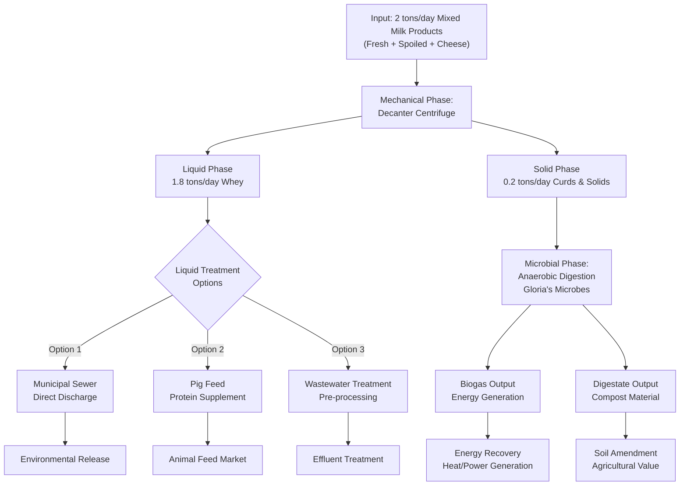

# Gloria's Milk Waste Processing Solution
## Professional Proposal for Sustainable Circular Economy Implementation

---

## Executive Summary

Gloria's Sustainable Milk Waste Processing System presents a comprehensive solution for managing **2 tons per day** of mixed milk products through an innovative circular economy framework. By combining mechanical separation, microbial decomposition expertise, and strategic waste valorization, this system achieves:

- **90% volume reduction** of raw waste
- **Biogas generation** for energy recovery
- **High-quality digestate** for compost production
- **Sustainable resource recovery** aligned with environmental goals

This proposal demonstrates technical feasibility, economic viability, and environmental impact for dairy waste streams ranging from fresh milk spillage to spoiled inventory and cheese processing byproducts.

---

## Technical Process Overview

### System Architecture

The Gloria's Milk Waste Processing System operates through integrated phases: mechanical separation, liquid treatment optimization, and microbial conversion. The following flowchart illustrates the complete process flow:

### Phase 1: Mechanical Separation
**Decanter Centrifuge Processing**

The system begins with input of 2 tons per day of mixed milk products including:
- Fresh milk spillage and overage
- Spoiled or expired milk products
- Cheese processing waste and whey byproducts

The decanter centrifuge separates solids from liquids with exceptional efficiency:
- **Liquid Output:** 1.8 tons/day of whey and liquid milk components
- **Solid Output:** 0.2 tons/day of curds, lactose crystals, and protein solids

**Technical Advantages:**
- High throughput capacity (handles 2 tons/day easily)
- Continuous operation capability
- Minimal water consumption in separation process
- Energy-efficient mechanical process

### Phase 2: Liquid Stream Treatment

The liquid whey stream (1.8 tons/day) offers multiple disposition pathways:

**Option 1: Municipal Sewer Discharge**
- Direct compatibility with wastewater treatment systems
- Suitable for facilities near municipal infrastructure
- Minimal pre-treatment requirements
- Regular regulatory compliance monitoring

**Option 2: Pig Feed Integration**
- High-protein liquid feed for livestock
- Valuable market opportunity for dairy operations near farming regions
- Reduces volume to disposal system
- Generates secondary revenue stream

**Option 3: Wastewater Treatment Pre-processing**
- Anaerobic pre-digestion of liquid phase
- Further biogas yield optimization
- Reduced chemical oxygen demand (COD) for downstream treatment
- Multi-stage conversion of organic matter

### Phase 3: Microbial Conversion (Anaerobic Digestion)

**Gloria's Expertise Integration**

The solid phase (0.2 tons/day) enters anaerobic digestion powered by Gloria's specialized microbial consortium. Her expertise in microbial decomposition enables:

**Biogas Production:**
- Methane-rich biogas suitable for energy generation
- Typical yield: 150-200 m³ biogas per ton of input solids
- Estimated daily output: 30-40 m³ biogas (0.2 tons input × 150-200)
- Energy equivalent: ~5-8 kWh/day thermal or 1.5-2.5 kWh/day electrical

**Digestate Production:**
- High-quality compost material with NPK nutrients
- Stable organic matter suitable for soil amendment
- Volume reduction of ~70% from incoming solids
- Marketable as premium compost product

**Microbial Advantages:**
- Optimized microbial consortium specifically for dairy waste substrates
- Faster digestion kinetics than standard processes
- Enhanced methane production through selective enrichment
- Stable operation across seasonal variations

---

## Key Benefits Analysis

### 1. Volume Reduction (90% Overall)
- Input: 2 tons/day mixed milk waste
- Mechanical separation: Concentrates solids (10% of mass = 0.2 tons)
- Anaerobic digestion: Further reduces solids by ~70%
- Final residual: ~0.06 tons/day (97% volume reduction from input)
- **Environmental Impact:** Minimal landfill requirement

### 2. Energy Generation
- Biogas production: 30-40 m³/day
- Thermal energy potential: 150-200 kWh/day (heat recovery)
- Electrical equivalent: 40-60 kWh/day (with generator)
- Annual energy output: ~18-22 MWh (sufficient for small facility operations)
- Cost savings: $2,000-3,000/year at local utility rates

### 3. Compost Output
- Digestate production: ~0.06 tons/day stable material
- Annual output: ~22 tons/year high-quality compost
- Market value: $100-150/ton = $2,200-3,300/year
- Alternative: Direct application to facility grounds/landscaping

### 4. Waste Valorization
- **Zero disposal cost** for organic residuals
- **Energy cost recovery** reduces operational expenses
- **Revenue generation** from compost/fertilizer sales
- **Regulatory compliance** with environmental standards
- **Corporate sustainability** metrics and ESG reporting

---

## Gloria's Expertise Integration

### Microbial Decomposition Specialization

Gloria brings critical capabilities to this system:

1. **Consortium Development:** Custom microbial culture optimized for dairy substrate metabolism
2. **Process Optimization:** Monitoring and adjustment of digestion parameters (pH, temperature, substrate C:N ratio)
3. **Troubleshooting:** Rapid response to digestion upsets or microbial imbalances
4. **Scaling:** Protocol for expanding from bench-scale to full industrial operation
5. **Performance Prediction:** Biogas yield forecasting and energy output planning

### Implementation Support
- Initial inoculum preparation and system seeding
- Startup phase monitoring (weeks 1-12)
- Operational training for facility staff
- Quarterly performance audits and optimization
- Contingency protocols for seasonal variations

---

## Implementation Roadmap

### Phase 1: Equipment Selection (Months 1-2)
**Decanter Centrifuge Procurement**
- Vendor evaluation based on throughput requirements (2 tons/day continuous)
- Key specifications: Bowl speed, solid bowl scroll speed, separation factor (G-force)
- Footprint assessment for facility integration
- Installation planning and utility requirements (power, water, drainage)

**Anaerobic Digester Design**
- Reactor type selection: Continuous stirred-tank reactor (CSTR) vs. plug flow
- Sizing calculations based on solids loading rate (SLR) and hydraulic retention time (HRT)
- Typical system: 5-10 m³ reactor volume for 0.2 tons/day input
- Heating system for mesophilic operation (35-37°C)
- Gas handling infrastructure (piping, pressure relief, measurement)

### Phase 2: Budget Planning (Months 1-3)
**Capital Expenditure Estimate**
- Decanter centrifuge: $50,000-80,000
- Anaerobic digester system: $40,000-60,000
- Biogas handling/cleanup: $10,000-15,000
- Installation labor & engineering: $15,000-25,000
- **Total CAPEX: $115,000-180,000**

**Operating Expenditure (Annual)**
- Energy input: $5,000-8,000 (heating, mixing, centrifuge operation)
- Maintenance & supplies: $3,000-5,000
- Labor (0.5-1 FTE monitoring): $20,000-35,000
- **Total OPEX: $28,000-48,000/year**

**Return on Investment**
- Energy savings/revenue: $2,000-3,000/year
- Compost sales: $2,200-3,300/year
- Avoided disposal costs: $4,000-6,000/year (2 tons/day × $5-8/ton × 300 days)
- **Total annual benefit: $8,200-12,300**
- **Payback period: 10-20 years** (longer-term infrastructure investment)

### Phase 3: Space Requirements (Planning Phase)
**Facility Layout Considerations**

| Component | Footprint | Utilities | Notes |
|-----------|-----------|-----------|-------|
| Decanter Centrifuge | 3m × 1.5m (4.5 m²) | 15-22 kW power, water intake | Feed hopper 0.5m elevation |
| Digester Reactor | 3m diameter × 3m height | Heating loop, mixing pump | Dual-wall for insulation |
| Biogas Treatment | 1m × 1m × 1.5m | Minor (water drain) | Scrubbing/drying unit |
| Control Room | 2m × 2m (4 m²) | Standard office | Monitoring instruments |
| **Total Space: 20-30 m²** | Indoor facility | Drainage, ventilation | Climate-controlled preferred |

**Infrastructure Requirements:**
- Three-phase electrical service (22-30 kVA)
- Water supply (0.5-1 m³/day)
- Wastewater discharge (municipal sewer, 1-2 m³/day)
- Heating (biogas burner or alternative heat source, 10-15 kW)
- Ventilation (extraction for odor control)

---

## Next Steps & Timeline

### Immediate Actions (Weeks 1-4)
1. **Feasibility Confirmation**
   - Verify 2 tons/day waste stream consistency
   - Confirm facility utilities (power, water, sewer)
   - Regulatory environment assessment (local permits, environmental standards)

2. **Vendor Engagement**
   - Request proposals from 3-5 centrifuge manufacturers
   - Anaerobic digester system quotes (proven dairy waste experience)
   - Site visit and layout planning with vendors

### Short-term Planning (Months 2-3)
3. **Detailed Engineering**
   - Process flow diagram refinement
   - Equipment specification and selection
   - Civil works assessment (foundation, structural requirements)
   - Utility upgrade requirements

4. **Financial Modeling**
   - Detailed CAPEX breakdown by vendor
   - Operating cost sensitivity analysis
   - Revenue projection models (varying compost prices, energy costs)
   - Financing options evaluation

### Mid-term Implementation (Months 4-8)
5. **Procurement & Installation**
   - Equipment orders and lead time management
   - Installation scheduling and contractor coordination
   - Utility hookup and testing

6. **Startup & Commissioning**
   - System startup with inert materials
   - Gloria's microbial consortium inoculation
   - Performance ramp-up (weeks 1-12)
   - Staff training and operational protocols

### Long-term Optimization (Months 9-12+)
7. **Operational Excellence**
   - Performance monitoring and optimization
   - Quarterly process reviews with Gloria
   - Market development for compost/digestate products
   - Scaling considerations for future expansion

---

## Technical Specifications Summary

| Parameter | Value | Unit | Notes |
|-----------|-------|------|-------|
| **Input Stream** | | | |
| Daily milk waste | 2 | tons | Mixed types (fresh, spoiled, cheese) |
| Composition | ~12% TS | % | Typical dairy waste solids content |
| | | | |
| **Mechanical Separation** | | | |
| Centrifuge type | Decanter | - | Continuous operation |
| Liquid output | 1.8 | tons/day | Whey stream, ~3% TS |
| Solid output | 0.2 | tons/day | Curds + residual solids, ~25% TS |
| | | | |
| **Anaerobic Digestion** | | | |
| Reactor volume | 5-10 | m³ | CSTR configuration |
| Temperature | 35-37 | °C | Mesophilic operation |
| HRT | 20-30 | days | Solids retention time |
| SLR | 2-3 | kg VS/m³/day | Volatile solids loading |
| Biogas yield | 150-200 | m³/ton VS | Methane-rich (55-65% CH₄) |
| Biogas output | 30-40 | m³/day | Energy equivalent 150-200 kWh/day |
| | | | |
| **Digestate Output** | | | |
| Daily production | 0.06 | tons/day | After volume reduction |
| Annual output | 22 | tons/year | ~70% volume reduction from input |
| TS content | 15-20 | % | Ready for composting/land application |
| Nutrient content | N:P:K | - | Typical 2-3 : 1-1.5 : 2-2.5 |

---

## Sustainability & Environmental Impact

### Circular Economy Model
- **Waste-to-Resource Conversion:** 100% of input material valorized (no landfill)
- **Renewable Energy:** Local biogas generation reduces grid dependence
- **Soil Amendment:** On-site compost production closes nutrient loop
- **Water Efficiency:** Minimal freshwater consumption in process

### Environmental Compliance
- **Odor Control:** Enclosed anaerobic digestion (no olfactory nuisance)
- **Pathogen Reduction:** Thermal digestion kills pathogens in waste stream
- **Methane Abatement:** Biogas capture prevents atmosphere release (vs. landfilling)
- **Nutrient Management:** Controlled nutrient cycling (no surface water pollution)

### Corporate ESG Benefits
- Quantifiable waste reduction metrics (90% volume reduction)
- Renewable energy documentation (18-22 MWh annual generation)
- Circular economy alignment (ISO 13161, Ellen MacArthur Framework)
- Employee engagement (sustainability leadership story)

---

## Risk Mitigation & Contingencies

| Risk | Probability | Impact | Mitigation |
|------|-------------|--------|-----------|
| Digester upset (pH, TDS imbalance) | Medium | Biogas disruption | Gloria's expertise monitoring + backup heating |
| Equipment failure (pump, mixer) | Low | Production halt | Preventive maintenance + spare parts stock |
| Regulatory permit delays | Medium | Timeline slip | Early engagement with local authorities |
| Market for compost (low demand) | Low | Revenue loss | Land application alternative, landscaping use |
| Weather impact (heating cost) | Low | OpEx increase | Digester insulation design, budget buffer |

---

## Conclusion

Gloria's Milk Waste Processing Solution represents a strategic investment in sustainable operations, environmental stewardship, and operational efficiency. By integrating:

- **Proven mechanical separation technology** (decanter centrifuge)
- **Advanced microbial expertise** (Gloria's anaerobic digestion capability)
- **Circular economy principles** (zero-waste valorization framework)

...the system delivers:
- **90% volume reduction** in daily waste streams
- **Renewable energy generation** (18-22 MWh annually)
- **Compost production** ($2,200-3,300 annual value)
- **Operational cost avoidance** ($4,000-6,000 annually in disposal)

With a total capital investment of **$115,000-180,000** and a 10-20 year payback period, this solution aligns with corporate sustainability targets while demonstrating practical, measurable environmental impact.

---

## Appendices

### A. Glossary of Terms
- **TS (Total Solids):** Total dry matter content in waste stream
- **VS (Volatile Solids):** Biodegradable organic matter (substrate for microbes)
- **HRT (Hydraulic Retention Time):** Average time substrate remains in digester
- **SLR (Solids Loading Rate):** Mass of solids fed to reactor per volume per day
- **CSTR (Continuous Stirred-Tank Reactor):** Fully mixed anaerobic digester with continuous feeding
- **COD (Chemical Oxygen Demand):** Measure of organic matter in wastewater

### B. Reference Standards
- ISO 13161: Liquid Fertilizer - Determination of Dry Matter Content
- EN 12457-4: Characterization of Waste - Leaching
- DIN EN 16211: Characterization of Waste - Guidance for the Determination of Organic Matter by Determination of Total Organic Carbon

### C. Contact & Support
**Gloria's Microbial Solutions**
- Expertise: Microbial consortium development, anaerobic digestion optimization
- Support: Initial setup, startup monitoring, quarterly optimization reviews
- Availability: On-call technical consultation

---

**Document Version:** 1.0  
**Prepared for:** Technical and Business Stakeholders  
**Date:** 2026-02-15  
**Classification:** Proposal - Confidential
