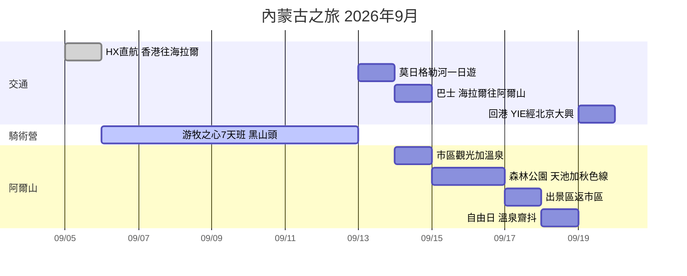

# 🐎 內蒙古騎馬之旅 | 2026-09-05 → 09-19

> 7天游牧之心騎術班（G1 零基礎）+ 阿爾山秋季森林延伸遊
> 獨行 | 經濟艙 | 中檔住宿 | 總預算約 HK$23,600

## 📌 TL;DR

1. **抵達日（Sep 5）** — 降落海拉爾（HX直航 16:40 到），傍晚市區觀光 + 補齊騎馬裝備，翌朝 9 點騎術學校專車接送。
2. **騎術營（Sep 6–12）** — **黑山頭**馬場 7 日騎術班（G1 零基礎），中段重頭戲 **25km 根河濕地馬背穿越**。7 日風景已覆蓋額爾古納/滿洲里同類景觀（西/中段景點跳過）。
3. **海拉爾慢遊（Sep 12–13）** — Sep 12 下午返海拉爾；Sep 13 **莫日格勒河**「天下第一曲水」一日遊玩到日落（騎馬後恢復日），晚上買定巴士飛。
4. **阿爾山段（Sep 14–18）** — Sep 14 巴士入阿爾山（經紅花爾基，坐左邊窗）→ 市區溫泉一晚 → 國家公園兩日（1號線天池 + 2號線秋色）宿景區內 → Sep 17 出園 → **Sep 18 自由日**（溫泉/齋抖）。
5. **回程（Sep 19）✅ 已定案：直線版** — 11:50 YIE→北京大興（唯一班次，逢二四六飛）→ 19:00 南航 → 22:45 到港。免 4 小時折返巴士，回程 ~HK$2,134。

## 🛏️ 過夜城市 & 交通一覽

| 晚 | 日期 | 過夜地點 | 住宿 | 當日交通 |
|----|------|---------|------|---------|
| 1 | Sep 5 | **海拉爾** | 全季（成吉思汗廣場店）| ✈️ HX直航 12:05 HKG → 16:40 HLD |
| 2–7 | Sep 6–11 | **黑山頭馬場** | 營方包食宿 | 🚐 營方專車 Sep 6 朝9點接 |
| 8 | Sep 12 | **海拉爾** | 全季（第2晚）| 🚐 營方送返，15:00 到 |
| 9 | Sep 13 | **海拉爾** | 全季（第3晚）| 🚕 的士來回莫日格勒河（~¥80-100/程），晚上買巴士飛 |
| 10 | Sep 14 | **阿爾山市** | 聖彼得堡大酒店 | 🚌 06:30/07:40 巴士，¥95，4h（S203 經紅花爾基，坐左邊窗）|
| 11–12 | Sep 15–16 | **森林公園景區內** | 林溪山莊 | 🚌 07:40 官方班車 ¥21（1.5h）；園內景交套票 ¥280 |
| 13 | Sep 17 | **阿爾山市** | 聖彼得堡（第2晚）| 🚌 14:30 唯一班車出園 ¥21 |
| 14 | Sep 18 | **阿爾山市** | 聖彼得堡（第3晚）| 自由日：溫泉/古蹟/齋抖 |
| — | Sep 19 | （機上/屋企）| — | ✈️ 11:50 YIE→PKX（首都航空）→ 19:00 南航 → 22:45 HKG |

**記法：一條直線唔走回頭 — 海拉爾3晚連住尾段冇份，阿爾山市3晚（夾住景區2晚），馬場6晚全包。**

## 📍 地圖

```mapview
{"name":"內蒙古之旅","mapZoom":6,"centerLat":48.3,"centerLng":119.9,"query":"","chosenMapSource":1,"autoFit":true,"lock":false,"showLinks":false,"markerLabels":"off","embeddedHeight":400}
```

## 📅 行程表（自動更新）

新增行程 = 喺呢個資料夾開一個 note，填 frontmatter（`date`/`start`/`end`/`place`/`itinerary: true`），下表自動出現。

```dataview
TABLE WITHOUT ID file.link as "項目", date as "日期", start as "開始", end as "結束", place as "地點"
FROM "notes/內蒙古之旅"
WHERE itinerary
SORT date ASC, start ASC
```

### 今日行程
```dataview
TABLE WITHOUT ID file.link as "項目", start as "開始", end as "結束", place as "地點"
FROM "notes/內蒙古之旅"
WHERE itinerary AND dateformat(date, "yyyy-MM-dd") = dateformat(date(today), "yyyy-MM-dd")
SORT start ASC
```

## ✅ 待辦清單（自動彙總）

```dataview
TASK FROM "notes/內蒙古之旅"
WHERE !completed
```

## 📆 時間線



## 💰 預算

| 項目 | 金額 |
|------|------|
| 騎術營 7天（全包） | ~¥11,600 (~HK$12,500) |
| 機票 HKG→HLD | HK$2,503 |
| 回程機票 YIE+PKX | HK$2,134 |
| 酒店 8晚 | ~HK$3,620 |
| 交通（巴士+景交+的士） | ~¥600 (~HK$650) |
| 餐飲雜費 | ~¥1,700 (~HK$1,800) |
| **合計** | **~HK$23,600** |

## 📞 重要聯絡

| 對象 | 方式 |
|------|------|
| 游牧之心 葉丹 | WeChat: `horsemans` / +86-150 4975 1015 |
| 馬場收件（德軍） | 13722015698（額爾古納市黑山頭鎮梁西村） |
| 阿爾山客運站 | 0482-2256104 |
| 游牧之心官網 | http://www.ihorsemen.com |

## 🗾 參考：貓五郎大環線（下次北段用）


*[貓五郎 Neko Goro](https://youtu.be/FgG8snEP0Jc?t=157)嘅3,000km自駕環線。同本行程重疊：海拉爾、阿爾山；佢有我冇（留待2027冬季北征）：漠河/北極村、根河（冷極+馴鹿）、滿歸、室韋、滿洲里/呼倫湖（葉丹✗）、柴河。*

## 📝 備注
- 9月中旬草原早晚涼，帶保暖層（參考葉丹提供 2021-08-29 溫度記錄）
- 呼倫貝爾營期：5月初–10月初（國慶後停業）
- 快遞：京東/德邦到唔到黑山頭，其他快遞可以（時效+1~2天）
- 行前準備：[2026呼倫貝爾騎術班行前準備](https://mp.weixin.qq.com/s/Jft25cMEN9NOvoudB7V5HQ)（WeChat 內開）
